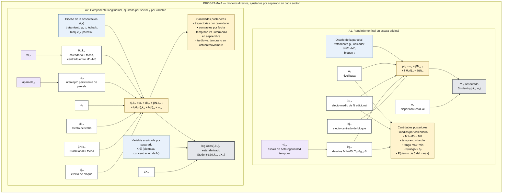

```mermaid
flowchart TB
  classDef fixed fill:#e8f1fb,stroke:#315f8c,color:#111,stroke-width:1px;
  classDef hyper fill:#efe8fb,stroke:#654c8d,color:#111,stroke-width:1px;
  classDef latent fill:#ffffff,stroke:#374151,color:#111,stroke-width:1.3px;
  classDef observed fill:#e5e7eb,stroke:#111827,color:#111,stroke-width:1.5px;
  classDef derived fill:#fff3cd,stroke:#8a6d1d,color:#111,stroke-width:1px;

  subgraph A["PROGRAMA A — modelos directos, ajustados por separado en cada sector"]
    direction TB

    subgraph A1["A1. Rendimiento final en escala original"]
      direction LR
      AYx["Diseño de la parcela i<br/>tratamiento gᵢ, indicador Iᵢ=M1–M5,<br/>bloque jᵢ"]:::fixed

      AYalpha["αₛ<br/>nivel basal"]:::latent
      AYbeta["βN,ₛ<br/>efecto medio de N adicional"]:::latent
      AYtau["τθ,ₛ<br/>escala de heterogeneidad temporal"]:::hyper
      AYtheta["θg,ₛ<br/>desvíos M1–M5, Σg θg,ₛ=0"]:::latent
      AYblock["bj,ₛ<br/>efecto centrado de bloque"]:::latent
      AYsigma["σₛ<br/>dispersión residual"]:::latent

      AYmu["μi,ₛ = αₛ + βN,ₛ Iᵢ<br/>+ Iᵢ θg(i),ₛ + bj(i),ₛ"]:::derived
      AYobs["Yi,ₛ observado<br/>Student-t₅(μi,ₛ, σₛ)"]:::observed
      AYout["Cantidades posteriores<br/>• medias por calendario<br/>• M1–M5 − M0<br/>• temprano − tardío<br/>• rango max−min<br/>• P(rango &gt; δ)<br/>• P(dentro de δ del mejor)"]:::derived

      AYtau --> AYtheta
      AYx --> AYmu
      AYalpha --> AYmu
      AYbeta --> AYmu
      AYtheta --> AYmu
      AYblock --> AYmu
      AYmu --> AYobs
      AYsigma --> AYobs
      AYalpha --> AYout
      AYbeta --> AYout
      AYtheta --> AYout
    end

    subgraph A2["A2. Componente longitudinal, ajustado por sector y por variable"]
      direction LR
      ALx["Diseño de la observación (i,k)<br/>tratamiento gᵢ, Iᵢ, fecha k,<br/>bloque jᵢ, parcela i"]:::fixed
      ALwhich["Variable analizada por separado<br/>X ∈ {biomasa, concentración de N}"]:::fixed

      ALalpha["αₛ"]:::latent
      ALdate["dk,ₛ<br/>efecto de fecha"]:::latent
      ALbeta["βN,k,ₛ<br/>N adicional × fecha"]:::latent
      ALtau["τθ,ₛ"]:::hyper
      ALtheta["θg,k,ₛ<br/>calendario × fecha,<br/>centrado entre M1–M5"]:::latent
      ALblock["bj,ₛ<br/>efecto de bloque"]:::latent
      ALplotsd["σparcela,ₛ"]:::hyper
      ALplot["ui,ₛ<br/>intercepto persistente de parcela"]:::latent
      ALsigma["σX,ₛ"]:::latent

      ALeta["ηi,k,ₛ = αₛ + dk,ₛ + βN,k,ₛ Iᵢ<br/>+ Iᵢ θg(i),k,ₛ + bj(i),ₛ + ui,ₛ"]:::derived
      ALobs["log Xobs(i,k,ₛ), estandarizado<br/>Student-t₅(ηi,k,ₛ, σX,ₛ)"]:::observed
      ALout["Cantidades posteriores<br/>• trayectorias por calendario<br/>• contrastes por fecha<br/>• temprano vs. intermedio en septiembre<br/>• tardío vs. temprano en octubre/noviembre"]:::derived

      ALtau --> ALtheta
      ALplotsd --> ALplot
      ALx --> ALeta
      ALwhich --> ALobs
      ALalpha --> ALeta
      ALdate --> ALeta
      ALbeta --> ALeta
      ALtheta --> ALeta
      ALblock --> ALeta
      ALplot --> ALeta
      ALeta --> ALobs
      ALsigma --> ALobs
      ALeta --> ALout
    end
  end
```
