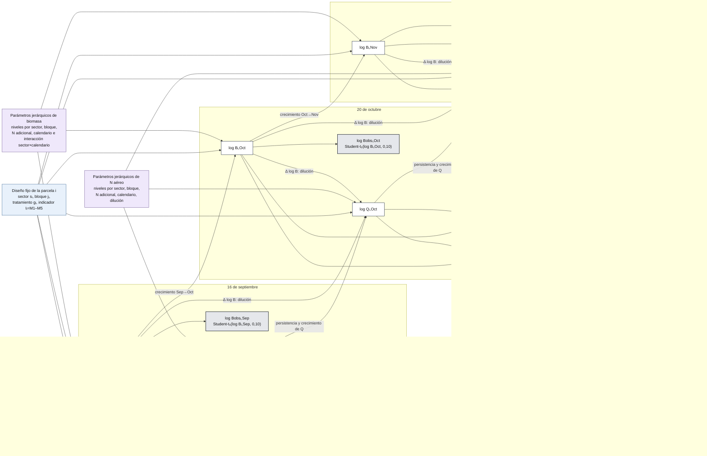

```mermaid
flowchart LR
  classDef fixed fill:#e8f1fb,stroke:#315f8c,color:#111,stroke-width:1px;
  classDef hyper fill:#efe8fb,stroke:#654c8d,color:#111,stroke-width:1px;
  classDef latent fill:#ffffff,stroke:#374151,color:#111,stroke-width:1.3px;
  classDef observed fill:#e5e7eb,stroke:#111827,color:#111,stroke-width:1.5px;
  classDef derived fill:#fff3cd,stroke:#8a6d1d,color:#111,stroke-width:1px;

  X["Diseño fijo de la parcela i<br/>sector sᵢ, bloque jᵢ,<br/>tratamiento gᵢ, indicador Iᵢ=M1–M5"]:::fixed
  V["vᵢ<br/>vigor latente compartido"]:::latent
  THB["Parámetros jerárquicos de biomasa<br/>niveles por sector, bloque,<br/>N adicional, calendario e interacción sector×calendario"]:::hyper
  THQ["Parámetros jerárquicos de N aéreo<br/>niveles por sector, bloque,<br/>N adicional, calendario, dilución"]:::hyper

  subgraph SEP["16 de septiembre"]
    direction TB
    B1["log Bᵢ,Sep<br/>biomasa latente"]:::latent
    Q1["log Qᵢ,Sep<br/>N aéreo latente"]:::latent
    BO1["log Bobsᵢ,Sep<br/>Student-t₅(log Bᵢ,Sep, 0,10)"]:::observed
    NO1["log N%obsᵢ,Sep<br/>Student-t₅(log 100 + log Q − log B, 0,06)"]:::observed
    D1["Determinísticos<br/>B=exp(log B), Q=exp(log Q)<br/>N%=100Q/B<br/>INN revisado e histórico"]:::derived
    B1 -->|"relación inicial δ₀"| Q1
    B1 --> BO1
    B1 --> NO1
    Q1 --> NO1
    B1 --> D1
    Q1 --> D1
  end

  subgraph OCT["20 de octubre"]
    direction TB
    B2["log Bᵢ,Oct"]:::latent
    Q2["log Qᵢ,Oct"]:::latent
    BO2["log Bobsᵢ,Oct<br/>Student-t₅(log Bᵢ,Oct, 0,10)"]:::observed
    NO2["log N%obsᵢ,Oct<br/>Student-t₅(log 100 + log Q − log B, 0,06)"]:::observed
    D2["B, Q, N% e INN<br/>derivados en cada simulación"]:::derived
    B2 --> BO2
    B2 --> NO2
    Q2 --> NO2
    B2 --> D2
    Q2 --> D2
  end

  subgraph NOV["12 de noviembre"]
    direction TB
    B3["log Bᵢ,Nov"]:::latent
    Q3["log Qᵢ,Nov"]:::latent
    BO3["log Bobsᵢ,Nov<br/>Student-t₅(log Bᵢ,Nov, 0,10)"]:::observed
    NO3["log N%obsᵢ,Nov<br/>Student-t₅(log 100 + log Q − log B, 0,06)"]:::observed
    D3["B, Q, N% e INN<br/>derivados en cada simulación"]:::derived
    B3 --> BO3
    B3 --> NO3
    Q3 --> NO3
    B3 --> D3
    Q3 --> D3
  end

  X --> B1
  X --> Q1
  X --> B2
  X --> Q2
  X --> B3
  X --> Q3
  V --> B1
  V --> Q1
  THB --> B1
  THB --> B2
  THB --> B3
  THQ --> Q1
  THQ --> Q2
  THQ --> Q3

  B1 -->|"crecimiento Sep→Oct"| B2
  B2 -->|"crecimiento Oct→Nov"| B3
  Q1 -->|"persistencia y crecimiento de Q"| Q2
  Q2 -->|"persistencia y crecimiento de Q"| Q3
  B1 -->|"Δ log B: dilución"| Q2
  B2 -->|"Δ log B: dilución"| Q2
  B2 -->|"Δ log B: dilución"| Q3
  B3 -->|"Δ log B: dilución"| Q3

  OUT["Inferencia derivada<br/>• trayectorias latentes de B, Q, N% e INN<br/>• rango final de INN entre M1–M5<br/>• probabilidades de contrastes temporales"]:::derived
  D1 --> OUT
  D2 --> OUT
  D3 --> OUT
```
