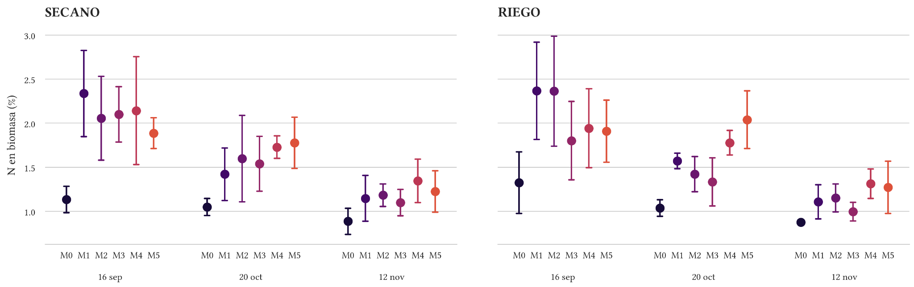

**UNIVERSIDAD DE LA REPÚBLICA**

**FACULTAD DE AGRONOMÍA**

**Efecto del momento de aplicación del nitrógeno durante invierno-primavera sobre el rendimiento de semilla y sus componentes en *Festuca arundinacea* Schreb. cv. Rizar, en sectores de secano y riego suplementario**

Trabajo final de grado 
Modalidad: Trabajo de Investigación 
Carrera: Ingeniería Agronómica

| **Tesistas:** | **Choca E. y Montero S.** |
| --- | --- |
| **Directora:** | Ana Cecilia Faber |
| **Codirector:** | Andrés Locatelli |
| **Institución:** | Facultad de Agronomía, Universidad de la República |
| **Año:** | 2026 |

# **Resumen**

Se evaluó el efecto del momento de aplicación de nitrógeno sobre el crecimiento, el estado nitrogenado, los componentes del rendimiento y el rendimiento de semilla de festuca alta (*Festuca arundinacea* Schreb.) cv. Rizar. El estudio se realizó durante 2025 en dos sectores próximos de un semillero establecido, uno manejado en secano y otro con riego suplementario. En cada sector se utilizó un diseño de bloques completos al azar con cuatro bloques y seis tratamientos. M1–M5 recibieron 200 kg N ha⁻¹, fraccionados en dos aplicaciones de 100 kg N ha⁻¹ realizadas en distintos momentos entre junio y septiembre, y M0 se incluyó como testigo sin nitrógeno experimental adicional. Se determinaron biomasa aérea, concentración y acumulación de nitrógeno, Índice de Nutrición Nitrogenada, densidad de panojas, número estimado de semillas por panoja, peso de mil semillas, índice de cosecha y rendimiento de semilla limpia. Entre M1–M5 no se detectaron diferencias significativas de rendimiento en secano ($p = 0{,}4287$) ni en riego suplementario ($p = 0{,}1759$). Las aplicaciones tempranas adelantaron la acumulación de biomasa y nitrógeno y tendieron a favorecer la densidad de panojas, mientras que las aplicaciones intermedias y tardías mantuvieron mayores concentraciones relativas de nitrógeno hacia etapas posteriores y tendieron a presentar más semillas estimadas por panoja. Se observó una relación inversa entre la densidad de panojas y el número estimado de semillas por panoja, que pudo atenuar las diferencias de rendimiento. Como referencia complementaria, todos los tratamientos fertilizados superaron a M0: el rendimiento medio de M1–M5 fue de 1365,79 kg ha⁻¹ frente a 702,63 kg ha⁻¹ en secano y de 1285,66 kg ha⁻¹ frente a 645,39 kg ha⁻¹ en el sector regado.

Se concluye que el momento de aplicación produjo diferencias entre tratamientos en fechas y variables específicas, pero no permitió identificar un tratamiento consistentemente superior para el rendimiento final.

Palabras clave: festuca alta; producción de semilla; fertilización nitrogenada; momento de aplicación; Índice de Nutrición Nitrogenada; riego suplementario.

# **1. Introducción**

La producción de semillas forrajeras constituye un componente fundamental para la implantación y renovación de pasturas en los sistemas pecuarios de base pastoril. En Uruguay, la festuca alta (*Festuca arundinacea* Schreb.) es una de las gramíneas perennes templadas de mayor importancia debido a su adaptación a diferentes ambientes, persistencia y producción otoño-invernal. Se ha estimado un uso promedio de 1979 toneladas de semilla de festuca por año, equivalente a aproximadamente 132 mil hectáreas sembradas anualmente, lo que justifica la generación de información local destinada a mejorar la productividad y estabilidad de los semilleros (Formoso, 2010; Reyno et al., 2024).

El manejo de un cultivo destinado a la producción de semilla difiere del correspondiente a una pastura utilizada con fines forrajeros. En un semillero, la acumulación de biomasa contribuye al rendimiento únicamente cuando se traduce en la formación y supervivencia de macollos reproductivos, panojas fértiles y semillas cosechables. Una producción elevada de materia seca no garantiza necesariamente un mayor rendimiento de semilla y puede incrementar la competencia por recursos, el sombreo, la senescencia, el vuelco y las pérdidas durante la cosecha.

El rendimiento de semilla se construye de manera secuencial a partir del número de panojas por unidad de superficie, el número de semillas por panoja y el peso individual de las semillas. Estos componentes se determinan en diferentes etapas del ciclo. Una mayor densidad de panojas puede reducir los recursos disponibles para cada inflorescencia, mientras que una menor densidad puede coincidir con un mayor número de semillas por panoja o con un mayor peso individual (Formoso, 2010).

La fertilización nitrogenada constituye una de las principales herramientas de manejo de los semilleros de festuca alta. El nitrógeno interviene en la expansión foliar, la fotosíntesis, el macollaje, la acumulación de biomasa y la formación de estructuras reproductivas. Sin embargo, la respuesta del cultivo no depende exclusivamente de la dosis aplicada, sino también del momento en que el nutriente queda disponible en relación con el desarrollo fenológico.

Una disponibilidad temprana de nitrógeno puede favorecer el crecimiento inicial, el macollaje y la supervivencia de los macollos que posteriormente formarán panojas. Las aplicaciones realizadas en etapas intermedias pueden coincidir con la diferenciación y el crecimiento de las inflorescencias, mientras que aplicaciones posteriores pueden contribuir al mantenimiento del área foliar y del estado nitrogenado durante la floración y el desarrollo de las semillas. En consecuencia, distintos calendarios de aplicación pueden generar trayectorias contrastantes de crecimiento y formación del rendimiento, aun cuando la dosis total aplicada sea la misma.

Antecedentes nacionales indican que el momento de aplicación del nitrógeno puede modificar el número de inflorescencias, el rendimiento de semilla y la producción adicional obtenida por unidad de nitrógeno aplicado. Sin embargo, la magnitud y dirección de la respuesta varían según el año, la edad y condición inicial del semillero, el cultivar, el manejo previo, la dosis total y las condiciones ambientales. Asimismo, estudios realizados en otros ambientes han mostrado que la dosis de nitrógeno puede ejercer un efecto más consistente que su fraccionamiento, por lo que las respuestas obtenidas en una situación determinada no deben trasladarse directamente a otros sistemas de producción (Formoso, 2010; Bazzigalupi y Bertín, 2014).

La respuesta a la fertilización también se encuentra condicionada por la disponibilidad hídrica. El agua interviene en la disolución y movilidad del fertilizante, la absorción del nitrógeno, la expansión foliar y la fotosíntesis. Una restricción hídrica puede limitar la utilización del nutriente, mientras que una mayor disponibilidad de agua puede aumentar el crecimiento y la demanda nitrogenada. No obstante, un mayor aporte de agua no determina necesariamente un incremento del rendimiento de semilla, especialmente cuando el crecimiento adicional no se transforma proporcionalmente en estructuras reproductivas cosechables.

La interpretación de la respuesta hídrica requiere considerar no solo la precipitación y el riego acumulados, sino también su distribución temporal, la capacidad de almacenamiento de agua del suelo, la profundidad y actividad del sistema radical y la demanda atmosférica.

La evolución del estado nitrogenado del cultivo puede evaluarse mediante la concentración de nitrógeno de la biomasa, la cantidad de nitrógeno acumulada y el Índice de Nutrición Nitrogenada. Este último relaciona la concentración observada con una concentración crítica dependiente de la biomasa y permite considerar el proceso de dilución del nitrógeno que acompaña al crecimiento del cultivo (Fernández et al., 2021). La respuesta productiva también puede caracterizarse mediante la eficiencia agronómica del nitrógeno y la productividad aparente del agua aportada. (Fixen et al., 2015; FAO, 2003).

El cultivar Rizar es un material de tipo continental-rizomatoso, caracterizado por su persistencia, rusticidad, sanidad y producción otoño-invernal. Aunque existe información nacional sobre su comportamiento forrajero, la información disponible acerca de la respuesta de sus semilleros al momento de aplicación del nitrógeno es limitada. En consecuencia, los antecedentes obtenidos con otros cultivares constituyen referencias relevantes, pero no necesariamente representan el comportamiento de Rizar bajo las condiciones de producción evaluadas (Maranges et al., 2019).

En el presente trabajo se compararon cinco calendarios de aplicación de una misma dosis experimental de nitrógeno (M1–M5); se incluyó M0 como testigo sin nitrógeno aplicado. Los tratamientos se establecieron en dos sectores próximos de un mismo semillero, uno manejado en secano y otro con riego suplementario. La respuesta a los momentos de aplicación se evaluó dentro de cada sector. La comparación media entre sectores se consideró descriptiva porque cada condición hídrica estuvo representada por un único sector.

El objetivo del trabajo fue evaluar el efecto del momento de aplicación de una dosis experimental total de 200 kg de nitrógeno por hectárea, fraccionada en dos aplicaciones, sobre el crecimiento, el estado nitrogenado, los componentes del rendimiento y el rendimiento de semilla de *Festuca arundinacea* Schreb. cv. Rizar, y determinar si el patrón de respuesta fue consistente entre los sectores de secano y riego suplementario.

# **2. Revisión bibliográfica**

## **2.1 Festuca alta y el cultivar Rizar**

La festuca alta (*Festuca arundinacea* Schreb.) es una gramínea perenne templada de metabolismo fotosintético C3, utilizada en los sistemas pastoriles por su persistencia, estabilidad productiva y capacidad de adaptación a condiciones ambientales diversas. En Uruguay constituye una de las principales gramíneas perennes de ciclo otoño-invernal, y su comportamiento productivo se encuentra condicionado por el cultivar, la edad de la pastura, la estructura del tapiz, el manejo previo, la disponibilidad de nutrientes y el régimen hídrico (Formoso, 2010).

La persistencia de la especie se relaciona con su capacidad para mantener una población de macollos y renovar las estructuras vegetativas a lo largo del tiempo. En un cultivo establecido conviven macollos de diferente edad, tamaño y estado fisiológico, cuya respuesta al ambiente y al manejo no es necesariamente uniforme. Esta heterogeneidad resulta particularmente importante en los cultivos destinados a la producción de semilla, donde solo una fracción de los macollos vegetativos alcanza la competencia reproductiva y completa la formación de una panoja cosechable.

El cultivar Rizar es un material de tipo continental-rizomatoso, desarrollado a partir de germoplasma de INIA Aurora y Rizomat. Se caracteriza por presentar hábito de crecimiento semipostrado, capacidad para formar un tapiz denso, persistencia, rusticidad y buen comportamiento sanitario frente a royas. Su fecha de floración es intermedia y similar a la del cultivar Estanzuela Tacuabé (Maranges et al., 2019).

Rizar fue liberado como resultado de la cooperación entre el Instituto Nacional de Investigación Agropecuaria, Grasslands Innovation y PGG Wrightson Seeds. Su proceso de selección estuvo orientado principalmente a la productividad forrajera, la persistencia, la presencia de rizomas, la producción otoño-invernal y la adaptación a los sistemas pastoriles nacionales (Maranges et al., 2019; Reyno et al., 2024).

Las características morfológicas y fenológicas del cultivar pueden influir en la respuesta del semillero al manejo nitrogenado. El hábito de crecimiento, la densidad del tapiz, la capacidad de macollaje y la fecha de floración pueden modificar la cantidad de macollos que alcanzan el estado reproductivo, la competencia entre estructuras y la sincronización entre la disponibilidad de nitrógeno y los procesos de formación del rendimiento.

En el presente experimento se utilizó un semillero de Rizar implantado en 2023 y previamente manejado mediante pastoreo y fertilización general. Por lo tanto, la respuesta a los tratamientos se produjo sobre un cultivo establecido, con una estructura de macollos desarrollada durante ciclos anteriores y condicionada por los antecedentes de manejo.

## **2.2 Formación del rendimiento de semilla**

En las gramíneas perennes, el macollo constituye la unidad básica capaz de originar una inflorescencia. Para contribuir al rendimiento de semilla, un macollo debe sobrevivir, alcanzar un estado fisiológico competente, responder a las señales que inducen la transición reproductiva y completar la elongación del tallo y la emergencia de la panoja. Por esta razón, el número total de macollos vegetativos presentes en el cultivo no equivale necesariamente al número de panojas que alcanzarán la cosecha.

La transición desde el estado vegetativo al reproductivo depende de la interacción entre las condiciones ambientales y el estado fisiológico de los macollos. La exposición a bajas temperaturas, el fotoperíodo, la disponibilidad de recursos y la acumulación de reservas intervienen en este proceso. Una vez iniciada la inflorescencia se definen las ramificaciones, las espiguillas y las flores potenciales. Posteriormente, la emergencia de la panoja, la antesis, la polinización, la fecundación, el aborto y el llenado determinan cuántos de esos sitios potenciales producen finalmente semillas cosechables.

El rendimiento de semilla puede expresarse mediante tres componentes principales: el número de panojas por unidad de superficie, el número de semillas por panoja y el peso individual de las semillas. El número de panojas integra la formación, la transición reproductiva y la supervivencia de los macollos fértiles. El número de semillas por panoja depende del desarrollo de la inflorescencia, la cantidad de flores potenciales, la fecundación y la retención de las semillas. El peso individual resulta del crecimiento y llenado posterior de las semillas (Formoso, 2010).

La relación entre estos componentes puede representarse mediante la siguiente ecuación:

$$
R_{\text{semilla}} =
N_{\text{panojas por unidad de superficie}}
\times
N_{\text{semillas por panoja}}
\times
P_{\text{semilla}}
$$

Esta identidad permite organizar los procesos involucrados en la formación del rendimiento, pero no implica que los componentes sean independientes. La modificación de uno de ellos puede alterar la disponibilidad de recursos para los restantes.

Una mayor densidad de panojas puede aumentar la cantidad potencial de sitios reproductivos por unidad de superficie, pero también puede intensificar la competencia entre inflorescencias por radiación, agua, nitrógeno y asimilados. En contraste, una menor densidad de panojas puede aumentar la disponibilidad de recursos por inflorescencia y permitir una mayor cantidad de semillas por panoja o un llenado más completo.

En consecuencia, los componentes del rendimiento pueden presentar relaciones inversas. Una práctica que aumenta el número de panojas no necesariamente incrementa el rendimiento final si simultáneamente disminuye el número de semillas por panoja o el peso individual. Del mismo modo, una menor densidad de panojas puede coincidir con un mayor rendimiento por inflorescencia. Estas relaciones pueden atenuar las diferencias finales, pero no garantizan que una pérdida ocurrida durante la formación de un componente sea recuperada por otro.

El peso de mil semillas suele presentar una variación menor que los componentes numéricos dentro de un mismo cultivar y ambiente. Cuando este componente se mantiene relativamente estable, una proporción importante de las diferencias de rendimiento se relaciona con el número de panojas y el número de semillas producidas en cada panoja.

La producción de biomasa aérea constituye otra variable relevante, debido a que representa la capacidad del cultivo para capturar recursos y producir materia seca. Sin embargo, una mayor acumulación de biomasa no asegura una mayor producción de semilla. El rendimiento depende también de la proporción de esa biomasa que se destina a las estructuras reproductivas.

El índice de cosecha expresa la relación entre el rendimiento de semilla y la biomasa aérea final. Dos tratamientos con una producción de biomasa semejante pueden diferir en rendimiento si presentan distinta partición hacia las semillas. De manera inversa, un tratamiento puede producir más biomasa sin aumentar el rendimiento cuando el crecimiento adicional permanece principalmente en hojas, tallos u otras estructuras vegetativas.

En los semilleros de gramíneas perennes, una acumulación excesiva de biomasa también puede aumentar el sombreo, la senescencia, el vuelco y las dificultades de cosecha. Por lo tanto, la evaluación del crecimiento debe complementarse con la medición de los componentes del rendimiento, el índice de cosecha y el rendimiento de semilla efectivamente recuperado.

La diferencia entre la producción biológica de semillas y el rendimiento limpio puede estar asociada con el desgrane previo a la cosecha, el vuelco, la maduración desuniforme, las pérdidas durante la recolección y la eliminación de material durante la limpieza. En el presente trabajo se determinaron el peso de la muestra antes y después de la limpieza.

El número de semillas por panoja utilizado en este estudio se estimó a partir del peso de la semilla limpia, el peso de mil semillas y el número de panojas cosechadas. Esta variable permite resumir de manera operativa esos registros, pero comparte matemáticamente el rendimiento de semilla.

Por esta razón, una asociación elevada entre el número estimado de semillas por panoja y el rendimiento no constituye una evidencia independiente de causalidad. Su interpretación debe realizarse conjuntamente con el número de panojas, el peso de mil semillas y el procedimiento utilizado para su cálculo.

En síntesis, el rendimiento de semilla resulta de una secuencia de procesos que comienza con la formación y supervivencia de macollos reproductivos y continúa con el desarrollo de las inflorescencias, la formación de semillas y su llenado. Las relaciones entre los componentes pueden hacer que tratamientos con trayectorias de crecimiento diferentes alcancen rendimientos finales similares, sin demostrar una recuperación completa de pérdidas ocurridas en etapas anteriores.

## **2.3 Nitrógeno y momento de aplicación**

El nitrógeno participa en la síntesis de proteínas, enzimas, ácidos nucleicos y clorofila, y cumple un papel central en la expansión foliar, la fotosíntesis, el macollaje y la acumulación de biomasa. En un cultivo destinado a la producción de semilla, su disponibilidad también puede influir sobre la formación y supervivencia de macollos reproductivos, el desarrollo de las inflorescencias y la cantidad de semillas producidas.

La respuesta del cultivo al nitrógeno depende de la dosis total, la fuente utilizada, el fraccionamiento, el momento de aplicación y la disponibilidad efectiva del nutriente. Esta última resulta de la interacción entre la oferta del suelo y del fertilizante, las transformaciones del nitrógeno, las pérdidas y la capacidad de absorción del cultivo.

El momento de aplicación determina la coincidencia entre la disponibilidad de nitrógeno y los procesos fisiológicos que forman el rendimiento. Una aplicación temprana puede favorecer la expansión foliar, el macollaje, el crecimiento inicial y la supervivencia de los macollos que posteriormente desarrollarán panojas. Una disponibilidad próxima a la iniciación o diferenciación reproductiva puede contribuir al desarrollo de las inflorescencias, mientras que aplicaciones posteriores pueden sostener el estado nitrogenado y el área fotosintética durante la floración y el crecimiento de las semillas.

Los antecedentes nacionales recopilados por Formoso (2010) muestran que el momento de aplicación del nitrógeno puede modificar el número de inflorescencias, el rendimiento de semilla y la cantidad adicional de semilla producida por unidad de nitrógeno aplicado. En varias situaciones, las aplicaciones realizadas hacia el final del invierno o el inicio de la primavera superaron a aplicaciones más tempranas.

Estas respuestas fueron relacionadas con una mayor disponibilidad de nitrógeno durante la iniciación y diferenciación reproductiva, lo que habría favorecido la transición de macollos vegetativos a reproductivos y la supervivencia de las estructuras formadas. Sin embargo, los resultados variaron entre años, edades de la pastura y condiciones de manejo, por lo que no puede establecerse una fecha óptima independiente del ambiente y del estado del cultivo.

Los antecedentes nacionales también muestran que la respuesta del rendimiento por inflorescencia fue menos consistente que la respuesta del número de panojas. Sin embargo, el fraccionamiento de la dosis no siempre produjo una ventaja respecto a una aplicación única realizada en un momento oportuno (Formoso, 2010).

En el norte de la provincia de Buenos Aires, Bazzigalupi y Bertín (2014) evaluaron dosis comprendidas entre 0 y 300 kg de nitrógeno por hectárea y aplicaciones enteras o fraccionadas a fines del invierno, bajo condiciones de riego. La dosis modificó el rendimiento y diversas variables asociadas, mientras que el fraccionamiento no produjo una ventaja constante.

Fairey y Lefkovitch (1998) también observaron en Canadá que la dosis, el método y el momento de aplicación afectaron la producción de semilla de festuca, aunque las respuestas variaron según el sitio y el año. En Oregon, una síntesis de más de tres décadas de investigación señaló que el nitrógeno es el nutriente que con mayor frecuencia limita el rendimiento de semilla, pero también indicó que dosis elevadas no garantizan un incremento proporcional de la producción y pueden dejar cantidades importantes de nitrógeno residual (Anderson et al., 2014).

En conjunto, estos antecedentes muestran que el nitrógeno puede modificar tanto el rendimiento como los procesos que intervienen en su formación. Sin embargo, la respuesta no depende de una fecha fija de aplicación, sino de la sincronización entre la disponibilidad del nutriente y la demanda del cultivo.

La disponibilidad efectiva del nitrógeno aplicado también depende de las condiciones posteriores a la fertilización. La urea distribuida en superficie debe disolverse y transformarse antes de que el nitrógeno pueda ser absorbido. La humedad y la temperatura del suelo, las precipitaciones o el riego posteriores, la actividad radical y las pérdidas por volatilización o lavado pueden modificar la cantidad y el momento en que el nutriente queda disponible.

Por esta razón, dos tratamientos aplicados en fechas diferentes pueden diferir no solo en su relación con la fenología, sino también en las condiciones meteorológicas y edáficas que determinan la transformación y absorción del fertilizante. La interpretación de los ensayos de momento de aplicación requiere, por lo tanto, considerar conjuntamente el calendario, el estado del cultivo y las condiciones ambientales.

## **2.4 Disponibilidad hídrica e interacción con el nitrógeno**

El agua interviene en la expansión celular, el transporte de nutrientes y asimilados, la fotosíntesis y la regulación térmica del cultivo. Su disponibilidad condiciona el crecimiento vegetativo, la actividad radical y la capacidad de absorción y utilización del nitrógeno.

El estado hídrico del cultivo no depende únicamente de la precipitación acumulada. También se encuentra determinado por la distribución temporal de las lluvias, la capacidad de almacenamiento de agua del suelo, la profundidad y actividad del sistema radical, la demanda atmosférica y las pérdidas por escurrimiento y drenaje.

El balance hídrico de una parcela puede representarse, de forma simplificada, como la suma de las entradas de agua por precipitación y riego, menos las pérdidas por evapotranspiración, escurrimiento y drenaje, considerando además la variación del agua almacenada en el suelo. La evapotranspiración integra el agua evaporada desde el suelo y la transpirada por el cultivo, por lo que constituye una aproximación más cercana al consumo efectivo que el aporte bruto de agua (Allen et al., 1998).

El riego suplementario consiste en realizar aportes limitados de agua a un cultivo predominantemente de secano, con el objetivo de reducir déficits durante períodos en que las precipitaciones resultan insuficientes. Su efecto depende de la magnitud, duración y momento de la restricción hídrica, así como del estado fenológico en que se encuentra el cultivo.

En festuca destinada a la producción de semilla, una mayor disponibilidad de agua puede sostener el crecimiento, la absorción de nitrógeno y la actividad fotosintética. Sin embargo, el incremento de la biomasa vegetativa no necesariamente se traduce proporcionalmente en un mayor rendimiento de semilla.

El agua disponible durante la formación de las estructuras reproductivas, la antesis y el llenado puede resultar particularmente relevante. Restricciones durante esas etapas pueden reducir la supervivencia de las estructuras florales, la formación de semillas y su crecimiento posterior.

En Oregon, Huettig et al. (2013) observaron que el riego de primavera incrementó el rendimiento de semilla de festuca de manera variable según el año y el cultivar. Los autores relacionaron la respuesta con la reducción del déficit hídrico entre la antesis y el llenado. Este antecedente muestra que el momento del aporte de agua puede ser más importante que la cantidad total aplicada durante el ciclo.

Los antecedentes nacionales también muestran que la respuesta de la festuca al riego varía entre períodos y situaciones de manejo. La disponibilidad hídrica interactúa con la fertilización nitrogenada y con el estado inicial del cultivo, por lo que un mismo aporte de agua puede producir respuestas diferentes según la disponibilidad de nitrógeno y la etapa de desarrollo (Formoso, 2010).

La interacción entre el nitrógeno y el agua puede manifestarse mediante diferentes mecanismos. Una restricción hídrica puede limitar la expansión foliar, el crecimiento de las raíces, el transporte de nutrientes y la absorción del nitrógeno. Al mismo tiempo, una mayor disponibilidad de nitrógeno puede aumentar el área foliar, la producción de biomasa y, en consecuencia, la demanda hídrica del cultivo.

Por lo tanto, la respuesta a una estrategia de fertilización nitrogenada puede variar según la disponibilidad de agua. En condiciones de déficit, parte del nitrógeno aplicado puede no ser utilizado plenamente por el cultivo. En condiciones de mayor disponibilidad hídrica, el nutriente puede sostener un crecimiento superior, aunque este crecimiento adicional no necesariamente se convierta en un mayor número de estructuras reproductivas o en un mayor rendimiento de semilla.

La oportunidad del riego también debe relacionarse con la formación secuencial de los componentes del rendimiento. Un aporte de agua realizado después de que el número de panojas o de flores potenciales ya fue definido puede sostener la biomasa o el llenado, pero difícilmente recupere componentes determinados en etapas anteriores.

## **2.5 Estado nitrogenado e Índice de Nutrición Nitrogenada**

La concentración de nitrógeno de la biomasa aérea disminuye a medida que el cultivo acumula materia seca, fenómeno conocido como dilución del nitrógeno. Esta reducción responde, entre otros factores, al aumento de la proporción de tejidos estructurales, al sombreo dentro del canopeo y a la redistribución del nutriente entre órganos (Lemaire y Salette, 1984; Gastal y Lemaire, 2002).

Las curvas críticas de dilución describen la concentración mínima de nitrógeno asociada con el crecimiento máximo para una biomasa determinada. La relación general se expresa como $N_{\text{crítico}} = aW^{-b}$, donde $W$ corresponde a la biomasa aérea, y los parámetros $a$ y $b$ representan, respectivamente, la concentración crítica a baja biomasa y la velocidad de dilución durante el crecimiento.

El Índice de Nutrición Nitrogenada se calcula como el cociente entre la concentración de nitrógeno observada y la concentración crítica estimada. Valores inferiores a uno indican una concentración menor que la definida por la curva crítica; valores próximos a uno corresponden a una condición cercana al nivel crítico; y valores superiores a uno indican una concentración por encima de esa referencia. Esta interpretación solo es válida dentro del rango de biomasa, la especie y la fase de desarrollo para los que la curva fue construida.

Como referencia histórica para gramíneas templadas C3 se utilizó la curva crítica $N_{\text{crítico}} = 4{,}8W^{-0{,}32}$, que representa la disminución de la concentración crítica de nitrógeno a medida que aumenta la biomasa aérea debido al proceso de dilución del nitrógeno durante el crecimiento (Lemaire y Gastal, 1997).

Fernández et al. (2021) reanalizaron información de festuca alta procedente de 14 combinaciones de genotipo, ambiente y manejo y propusieron la curva $N_{\text{crítico}} = 3{,}93W^{-0{,}42}$. Los autores concluyeron que la curva histórica $N_{\text{crítico}} = 4{,}8W^{-0{,}32}$ sobrestimaba la concentración crítica y, en consecuencia, podía producir valores menores del Índice de Nutrición Nitrogenada para una misma observación.

## **2.6 Eficiencia de uso del nitrógeno y productividad del agua**

La eficiencia agronómica del nitrógeno expresa el incremento de rendimiento obtenido por unidad de nitrógeno aplicado y se calcula como la diferencia de rendimiento entre un tratamiento fertilizado y su testigo sin fertilizar, dividida entre la dosis de nitrógeno agregada. Este indicador permite cuantificar la respuesta productiva al fertilizante. (Fixen et al., 2015).

La productividad del agua relaciona el rendimiento obtenido con la cantidad de agua considerada en el análisis. Cuando el denominador corresponde al agua aportada por precipitación y/o riego, el indicador expresa la producción por unidad de agua recibida. (FAO, 2003).

# **3. Objetivos e hipótesis**

## **3.1 Pregunta experimental**

¿Cómo afecta el momento de aplicación de una dosis experimental total de 200 kg N ha⁻¹, fraccionada en dos aplicaciones entre junio y septiembre, la dinámica de crecimiento y nutrición nitrogenada, los componentes del rendimiento y el rendimiento de semilla de festuca alta cv. Rizar, y en qué medida el patrón de respuesta es consistente entre los sectores de secano y riego suplementario?

## **3.2 Objetivo general**

Evaluar el efecto del momento de aplicación de una dosis experimental total de 200 kg N ha⁻¹, fraccionada en dos aplicaciones, sobre el crecimiento, el estado nitrogenado, los componentes del rendimiento y el rendimiento de semilla de *Festuca arundinacea* Schreb. cv. Rizar, y examinar la consistencia del patrón de respuesta entre los sectores próximos manejados bajo secano y riego suplementario.

## **3.3 Objetivos específicos**

- Describir, en cada fecha de evaluación, la producción de biomasa, la concentración y acumulación de nitrógeno y el Índice de Nutrición Nitrogenada frente a los distintos momentos de aplicación.

- Cuantificar el efecto del manejo nitrogenado sobre la densidad de panojas, el número estimado de semillas por panoja, el peso de mil semillas, el índice de cosecha y el rendimiento de semilla limpia.

- De manera complementaria, estimar la respuesta productiva por unidad de nitrógeno experimental mediante la eficiencia agronómica y describir la relación entre el rendimiento y el agua recibida mediante la productividad aparente del agua aportada.

- Comparar la respuesta a los momentos de aplicación dentro de cada sector y, de manera complementaria, evaluar mediante un análisis conjunto el efecto del momento y su interacción con el ambiente.

## **3.4 Hipótesis**

- Los momentos de aplicación producen diferencias en la biomasa, la concentración y acumulación de nitrógeno y el Índice de Nutrición Nitrogenada, así como en uno o más componentes del rendimiento.

- Los distintos momentos de aplicación generan patrones contrastantes en la densidad de panojas y el número estimado de semillas por panoja.

- El patrón relativo de respuesta al momento de aplicación del nitrógeno difiere entre los sectores de secano y riego suplementario.

- Los momentos que logran una mayor sincronización entre la oferta de nitrógeno y la demanda del cultivo producen mayor rendimiento y, en consecuencia, mayor eficiencia agronómica del nitrógeno y productividad aparente del agua aportada.

# **4. Materiales y métodos**

## **4.1 Sitio experimental**

El trabajo se realizó durante el ciclo productivo de 2025 en un semillero establecido de festuca alta (*Festuca arundinacea* Schreb.) cv. Rizar, ubicado en el establecimiento La Favorita, en el departamento de Soriano, Uruguay, en una zona rural próxima a Sacachispas. El sitio se localizó en las coordenadas geográficas 33°12′01,09″ S y 57°32′18″ O, a una elevación aproximada de 75 m sobre el nivel del mar. El paisaje corresponde a lomadas y los ensayos se ubicaron en una posición de ladera alta, sobre una pendiente suave de aproximadamente 3 %. El semillero fue implantado en 2023 y, al momento del experimento, correspondía a un cultivo establecido con antecedentes de utilización mediante pastoreo y fertilización general a escala de chacra.

Según la Carta de Suelos a escala 1:100.000, el sitio se ubicó en la unidad cartográfica Bequeló (BQ), caracterizada por la presencia de Brunosoles y Vertisoles con texturas comprendidas entre francas y limo-arcillosas. El área correspondió al grupo CONEAT 11.2.

Antes del período experimental se realizó una caracterización química del suelo. El análisis indicó un contenido de fósforo Bray 1 de 14 ppm, 91 % de saturación de bases, 3,4 % de materia orgánica y un pH de 6,04. Los contenidos de potasio, calcio, magnesio y sodio fueron 0,77; 20,5; 3,53 y 0,33 meq/100 g de suelo, respectivamente.

## **4.2 Material vegetal**

El material vegetal utilizado fue festuca alta (*Festuca arundinacea* Schreb.) cv. Rizar. Este cultivar, de tipo continental-rizomatoso, presenta hábito de crecimiento semipostrado, capacidad para formar un tapiz denso, persistencia, rusticidad y buen comportamiento sanitario frente a royas. Su fecha de floración es intermedia y similar a la del cultivar Estanzuela Tacuabé (Maranges et al., 2019). El semillero fue implantado en 2023 mediante siembra directa, con una densidad de 20 kg de semilla ha⁻¹.

## **4.3 Diseño experimental**

Se establecieron dos ensayos en sectores próximos de un mismo semillero. Uno se manejó en condiciones de secano y el otro recibió riego suplementario. En ambos se evaluaron los mismos seis tratamientos de fertilización nitrogenada.

Dentro de cada ensayo se utilizó un diseño de bloques completos al azar con cuatro bloques y una repetición de cada tratamiento por bloque. Los tratamientos se asignaron aleatoriamente a las parcelas dentro de cada sector.

Cada unidad experimental tuvo una superficie de 24 m², correspondiente a parcelas de 4 m de ancho por 6 m de largo. Cada ensayo estuvo integrado por 24 parcelas, resultantes de la combinación de seis tratamientos y cuatro bloques.

La parcela constituyó la unidad experimental para evaluar el efecto de los tratamientos nitrogenados dentro de cada ensayo. La condición hídrica, en cambio, estuvo representada por un único sector de secano y un único sector con riego suplementario, sin aleatorización ni replicación en unidades hídricas independientes. Por esta razón, las diferencias medias entre sectores no se interpretaron como un efecto causal exclusivo del riego. Se generó una asignación aleatoria de los tratamientos dentro de los bloques y la misma distribución se reprodujo en ambos sectores. Las parcelas estaban separadas por calles de 2 m. No se establecieron borduras experimentales específicas; el manejo del semillero, fuera de los ensayos se realizó a varios metros de las parcelas para minimizar posibles interferencias.

## **4.4 Tratamientos de fertilización nitrogenada**

Se evaluaron seis tratamientos definidos por el calendario de las aplicaciones experimentales de nitrógeno. M0 no recibió nitrógeno experimental adicional, mientras que M1–M5 recibieron 200 kg N ha⁻¹ experimentales, fraccionados en dos aplicaciones de 100 kg N ha⁻¹. La fuente utilizada fue urea con 46 % de nitrógeno, por lo que cada aplicación fue equivalente a 217,4 kg de urea por hectárea.

En cada aplicación se distribuyeron 0,522 kg de urea por parcela, equivalentes a 1,043 kg de urea por parcela al completar las dos aplicaciones. La dosis correspondiente a cada unidad experimental se pesó en un recipiente previamente tarado. La urea se distribuyó manualmente sobre toda la superficie, mediante varias pasadas y liberando el fertilizante de forma gradual para lograr la mayor uniformidad posible.

Las fechas de aplicación permitieron desplazar progresivamente la disponibilidad del nitrógeno desde junio hasta septiembre. La composición de los tratamientos se presenta en la Tabla 1.

Tabla 1. Tratamientos de fertilización nitrogenada, fechas de aplicación y dosis total de nitrógeno.

| **Tratamiento** | **Primera aplicación** | **Segunda aplicación** | **Nitrógeno experimental total** |
| --- | --- | --- | --- |
| M0 | Sin aplicación | Sin aplicación | $0\ \mathrm{kg\ N\ ha^{-1}}$ |
| M1 | 12 de junio | 31 de julio | $200\ \mathrm{kg\ N\ ha^{-1}}$ |
| M2 | 26 de junio | 31 de julio | $200\ \mathrm{kg\ N\ ha^{-1}}$ |
| M3 | 10 de julio | 21 de agosto | $200\ \mathrm{kg\ N\ ha^{-1}}$ |
| M4 | 31 de julio | 4 de septiembre | $200\ \mathrm{kg\ N\ ha^{-1}}$ |
| M5 | 21 de agosto | 20 de septiembre | $200\ \mathrm{kg\ N\ ha^{-1}}$ |

## **4.5 Manejo del cultivo**

### **4.5.1 Manejo previo y general del semillero**

Durante enero de 2025 el semillero fue utilizado mediante pastoreo rotativo. En marzo se aplicó Diuron 80 % a una dosis de 1,6 kg ha⁻¹ y en abril se realizó una fertilización general con 150 kg ha⁻¹ de urea azufrada, cuya composición fue de 40 % de nitrógeno y 5 % de azufre.

El pastoreo se suspendió previo a la instalación del ensayo. Al cierre, presentó un remanente de aproximadamente 15 cm, relativamente uniforme entre las parcelas.

En octubre se realizaron aplicaciones para el manejo sanitario del cultivo. Se aplicó un fungicida formulado con protioconazol y trifloxistrobin, a una dosis de 750 cm³ ha⁻¹, y un insecticida a base de clorantraniliprole, a una dosis de 12 g ha⁻¹.

Estas prácticas se realizaron uniformemente en el semillero y alcanzaron los sectores correspondientes a los ensayos de secano y riego suplementario.

### **4.6 Manejo hídrico**

Se evaluaron dos condiciones hídricas, correspondientes a los ensayos de secano y riego suplementario.

En el ensayo de secano, el cultivo dependió de las precipitaciones ocurridas durante el período experimental. En el ensayo bajo riego se utilizó un sistema de pivote central y se aplicaron 165 mm de agua suplementaria. El riego se distribuyó de la siguiente manera: 15 mm en junio, 30 mm en septiembre, 90 mm en octubre y 30 mm en noviembre de 2025.

Entre junio y noviembre se registraron 510 mm de precipitación. Los datos provinieron de una estación meteorológica ubicada en el predio. La distribución mensual fue de 43 mm en junio, 62 mm en julio, 101 mm en agosto, 89 mm en septiembre, 141 mm en octubre y 74 mm en noviembre. La precipitación acumulada entre enero y noviembre fue de 1176 mm.

Por lo tanto, durante el período comprendido entre junio y noviembre, el aporte de agua fue de 510 mm en el ensayo de secano y de 675 mm en el ensayo bajo riego, considerando en este último la suma de las precipitaciones y el riego suplementario.

## **4.7 Muestreos y determinaciones**

### **4.7.1 Fechas de muestreo**

Se realizó una evaluación inicial el 12 de junio, donde se caracterizó el estado inicial del cultivo mediante determinaciones de biomasa aérea y densidad de macollos.

Posteriormente, se realizaron muestreos de biomasa aérea y nitrógeno en planta en cada parcela los días 16 de septiembre, 20 de octubre y 12 de noviembre. Estos muestreos permitieron caracterizar la evolución de la biomasa y del estado nitrogenado durante el período reproductivo del cultivo.

La evaluación final de los componentes del rendimiento y del rendimiento de semilla se efectuó el 12 de noviembre.

### **4.7.2 Biomasa aérea**

En cada fecha de evaluación se cosechó la biomasa aérea presente en 1 m lineal de una hilera. Debido a que la distancia entre hileras fue de 0,38 m, cada muestra representó una superficie de 0,38 m².

La biomasa cosechada se pesó en fresco y se extrajo una submuestra representativa para determinar el porcentaje de materia seca. Las submuestras destinadas a materia seca se secaron en estufa a 70 °C hasta alcanzar peso constante. Las muestras destinadas a las determinaciones de calidad se secaron a 60 °C hasta peso constante y se remitieron al laboratorio de INIA. A partir del peso fresco total, el porcentaje de materia seca y la superficie evaluada se calculó la biomasa aérea, expresada en kilogramos de materia seca por hectárea.

La biomasa aérea se calculó mediante la siguiente expresión:

$$
\text{Biomasa aérea}\;(\mathrm{kg\ MS\ ha^{-1}}) =
\frac{
  \text{peso fresco total}\;(\mathrm{kg})
  \times \text{materia seca}\;(\%)
  \times 10\,000
}{
  100 \times 0{,}38
}
$$

Donde:

Biomasa aérea es la cantidad de materia seca presente por unidad de superficie, expresada en kg MS ha⁻¹.

Peso fresco total es la masa de la biomasa cosechada en la muestra, expresada en kilogramos.

Materia seca es el porcentaje del peso de la muestra, una vez eliminada el agua.

El factor 10.000 corresponde a la superficie de una hectárea, expresada en metros cuadrados.

El valor 0,38 corresponde a la superficie muestreada, expresada en metros cuadrados.

### **4.7.3 Densidad de macollos**

En la evaluación inicial se determinó la densidad de macollos mediante el conteo de los macollos presentes en 0,30 m lineales de una hilera.

Considerando una distancia entre hileras de 0,38 m, la superficie evaluada fue de 0,114 m².

La densidad de macollos se calculó mediante la siguiente expresión:

$$
\text{Densidad de macollos}\;(\mathrm{macollos\ m^{-2}}) =
\frac{\text{número de macollos contados}}{0{,}114\ \mathrm{m^2}}
$$

La superficie evaluada se obtuvo a partir de la longitud de hilera muestreada y la distancia entre hileras:

$$
\text{Superficie evaluada}\;(\mathrm{m^2}) =
0{,}30\ \mathrm{m} \times 0{,}38\ \mathrm{m} =
0{,}114\ \mathrm{m^2}
$$

### **4.7.4 Concentración y acumulación de nitrógeno**

En los muestreos efectuados durante el ciclo se determinó la concentración de nitrógeno de la biomasa aérea. Las muestras secas fueron remitidas al laboratorio de INIA, donde se determinó el nitrógeno total. La concentración se expresó como porcentaje de la materia seca.

La acumulación de nitrógeno en la biomasa aérea se calculó a partir de la biomasa producida y de su concentración de nitrógeno.

La acumulación de nitrógeno se calculó mediante la siguiente expresión:

$$
\text{Nitrógeno acumulado}\;(\mathrm{kg\ N\ ha^{-1}}) =
\frac{
  \text{biomasa aérea}\;(\mathrm{kg\ MS\ ha^{-1}})
  \times \text{concentración de nitrógeno}\;(\%)
}{100}
$$

Donde:

Nitrógeno acumulado es la cantidad de nitrógeno presente en la biomasa aérea, expresada en kg N ha⁻¹.

Biomasa aérea es la cantidad de materia seca presente por unidad de superficie, expresada en kg MS ha⁻¹.

Concentración de nitrógeno es el porcentaje de nitrógeno determinado en la materia seca de la muestra.

### **4.7.5 Evaluación final del cultivo**

El 12 de noviembre, una vez alcanzada la madurez fisiológica, se tomaron dos muestras independientes en cada parcela. Para determinar la biomasa aérea final se cosechó la totalidad de la parte aérea presente en 1 m lineal de una hilera, equivalente a 0,38 m². Las plantas se cortaron a nivel del suelo con tijera y la muestra incluyó hojas, tallos, panojas y semillas. Para determinar la densidad de panojas y el rendimiento de semilla se cosecharon dos tramos de 1 m lineal, correspondientes a dos hileras diferentes, con una superficie total de 0,76 m². Las panojas se cortaron dejando aproximadamente 15–20 cm de tallo por debajo de la inflorescencia y se colocaron en bolsas de papel.

Las muestras, que se encontraban secas al momento de la recolección, se mantuvieron en bolsas de papel para evitar la acumulación de humedad y el calentamiento del material. La trilla se realizó manualmente. Posteriormente, la semilla se limpió mediante zarandas y un sistema de corriente de aire, hasta separar los residuos y obtener la fracción considerada semilla limpia. La semilla se pesó antes y después de la limpieza, lo que permitió calcular el rendimiento sin limpiar, el rendimiento limpio y la proporción de material eliminado durante el proceso.

El peso de mil semillas se determinó en el laboratorio de INIA a partir de tres submuestras de 100 semillas por muestra. Se promedió el peso de las tres submuestras y el resultado se multiplicó por diez. A partir del peso de semilla limpia, el peso de mil semillas y el número de panojas cosechadas se estimó el número de semillas por panoja.

El rendimiento de semilla limpia, expresado en kilogramos por hectárea, se consideró la principal variable de respuesta productiva.

## **4.8 Variables calculadas**

### **4.8.1 Componentes del rendimiento y rendimiento de semilla**

La densidad de panojas se calculó a partir del número de panojas registradas en la superficie cosechada:

$$
\text{Densidad de panojas}\;(\mathrm{panojas\ m^{-2}}) =
\frac{\text{número de panojas contadas}}{0{,}76\ \mathrm{m^2}}
$$

El rendimiento de semilla sin limpiar se calculó mediante la siguiente expresión:

$$
\text{Rendimiento de semilla sin limpiar}\;(\mathrm{kg\ ha^{-1}}) =
\frac{
  \text{peso de semilla sin limpiar}\;(\mathrm{g}) \times 10
}{0{,}76\ \mathrm{m^2}}
$$

El rendimiento de semilla limpia se calculó mediante la siguiente expresión:

$$
\text{Rendimiento de semilla limpia}\;(\mathrm{kg\ ha^{-1}}) =
\frac{
  \text{peso de semilla limpia}\;(\mathrm{g}) \times 10
}{0{,}76\ \mathrm{m^2}}
$$

El factor 10 convierte gramos por metro cuadrado en kilogramos por hectárea, mientras que 0,76 m² corresponde a la superficie total cosechada en cada parcela.

La proporción de material eliminado durante la limpieza se calculó de la siguiente manera:

$$
\text{Merma de limpieza}\;(\%) =
\frac{
  \text{peso de semilla sin limpiar} - \text{peso de semilla limpia}
}{
  \text{peso de semilla sin limpiar}
}
\times 100
$$

El número de semillas por panoja se estimó mediante la siguiente expresión:

$$
\text{Número estimado de semillas por panoja} =
\frac{
  \text{peso de semilla limpia}\;(\mathrm{g}) \times 1000
}{
  \text{peso de mil semillas}\;(\mathrm{g})
  \times \text{número de panojas cosechadas}
}
$$

El índice de cosecha se calculó como la proporción de la biomasa aérea final representada por el rendimiento de semilla limpia. Ambas variables se expresaron por unidad de superficie y provinieron de las muestras independientes descritas anteriormente:

$$
\text{Índice de cosecha}\;(\%) =
\frac{
  \text{rendimiento de semilla limpia}\;(\mathrm{kg\ ha^{-1}})
}{
  \text{biomasa aérea final}\;(\mathrm{kg\ MS\ ha^{-1}})
}
\times 100
$$

### **4.8.2 Índice de Nutrición Nitrogenada**

El Índice de Nutrición Nitrogenada se calculó como la relación entre la concentración de nitrógeno observada en la biomasa aérea y la concentración crítica estimada para la cantidad de materia seca acumulada.

Previamente, la biomasa aérea se convirtió de kilogramos a toneladas de materia seca por hectárea:

$$
W\;(\mathrm{t\ MS\ ha^{-1}}) =
\frac{\text{biomasa aérea}\;(\mathrm{kg\ MS\ ha^{-1}})}{1000}
$$

Para el cálculo principal se utilizó la curva crítica de nitrógeno propuesta para festuca alta por Fernández et al. (2021):

$$
N_{\text{crítico}}\;(\%) = 3{,}93W^{-0{,}42}
$$

Posteriormente, el Índice de Nutrición Nitrogenada se calculó de la siguiente manera:

$$
\mathrm{INN} =
\frac{
  \text{concentración observada de nitrógeno}\;(\%)
}{
  N_{\text{crítico}}\;(\%)
}
$$

Como análisis de sensibilidad, el índice también se calculó mediante la curva crítica histórica utilizada para gramíneas templadas:

$$
N_{\text{crítico histórico}}\;(\%) = 4{,}8W^{-0{,}32}
$$

En ambas expresiones, W representa la biomasa aérea expresada en toneladas de materia seca por hectárea. La comparación entre las curvas permitió determinar en qué medida la referencia seleccionada modificó la magnitud absoluta del índice.

**4.8.3 Eficiencia agronómica del nitrógeno**

La respuesta productiva por unidad de nitrógeno aplicado se estimó mediante la eficiencia agronómica del nitrógeno.

Para cada tratamiento fertilizado se utilizó como referencia el rendimiento de M0 correspondiente al mismo bloque y ensayo:

$$
\text{Eficiencia agronómica del nitrógeno}\;
(\mathrm{kg\ semilla\ kg^{-1}\ N}) =
\frac{\text{rendimiento del tratamiento fertilizado} - \text{rendimiento de M0}}{200\ \mathrm{kg\ N\ ha^{-1}}}
$$

Donde:

Rendimiento del tratamiento fertilizado corresponde al rendimiento de semilla limpia de cada tratamiento M1–M5, expresado en kg ha⁻¹.

Rendimiento de M0 corresponde al rendimiento de semilla limpia del testigo sin nitrógeno del mismo bloque y ensayo, expresado en kg ha⁻¹.

El valor 200 corresponde a la dosis total de nitrógeno aplicada a los tratamientos fertilizados, expresada en kg N ha⁻¹.

La eficiencia agronómica se expresó en kilogramos adicionales de semilla limpia producidos por kilogramo de nitrógeno aplicado.

**4.8.4 Productividad aparente del agua aportada**

La relación entre el rendimiento de semilla y el agua aportada durante el período experimental se estimó mediante la productividad aparente del agua.

$$
\text{Productividad aparente del agua aportada}\;
(\mathrm{kg\ semilla\ ha^{-1}\ mm^{-1}}) =
\frac{
  \text{rendimiento de semilla limpia}\;(\mathrm{kg\ ha^{-1}})
}{
  \text{agua aportada}\;(\mathrm{mm})
}
$$

Para el ensayo de secano se utilizó como denominador la precipitación registrada entre junio y noviembre, correspondiente a 510 mm.

Para el ensayo bajo riego se utilizó la suma de las precipitaciones y del riego suplementario aplicado durante el mismo período, correspondiente a 675 mm.

La productividad aparente del agua se expresó en kilogramos de semilla limpia por hectárea y por milímetro de agua aportada.

Este indicador representa una relación operativa entre el rendimiento y el agua recibida por cada ensayo.

## **4.9 Análisis estadístico**

Debido a que los ensayos de secano y riego suplementario se establecieron en sectores diferentes del semillero y la condición hídrica no fue asignada aleatoriamente a unidades experimentales independientes, los análisis estadísticos principales se realizaron por separado para cada ensayo.

Dentro de cada ensayo se ajustó un análisis de varianza correspondiente a un diseño de bloques completos al azar. El modelo incluyó el efecto del tratamiento nitrogenado y el efecto del bloque.

El modelo general utilizado fue:

$$
Y_{ij} = \mu + T_i + B_j + \varepsilon_{ij}
$$

Donde:

$Y_{ij}$ corresponde al valor observado en el tratamiento $i$ y el bloque $j$.

$\mu$ representa la media general.

$T_i$ representa el efecto del tratamiento nitrogenado $i$.

$B_j$ representa el efecto del bloque $j$.

$\varepsilon_{ij}$ representa el error experimental asociado con la unidad experimental.

### **4.9.1 Comparación de los tratamientos**

Para las principales variables de respuesta se realizaron dos análisis complementarios dentro de cada ensayo.

El análisis principal incluyó únicamente los tratamientos fertilizados M1–M5. Como todos recibieron una dosis total de 200 kg N ha⁻¹, esta comparación permitió evaluar específicamente el efecto del momento de aplicación.

De manera complementaria, se analizaron los seis tratamientos M0–M5 para describir la respuesta al nitrógeno experimental adicional y ubicar a los calendarios de aplicación respecto al testigo M0.

Cuando el análisis de varianza detectó diferencias significativas entre tratamientos, las medias se compararon mediante la prueba de Tukey, con un nivel de significancia del 5 %.

Cuando el efecto del tratamiento no resultó significativo, las diferencias numéricas entre medias se consideraron únicamente descriptivas.

### **4.9.2 Análisis de las variables evaluadas durante el ciclo**

La biomasa aérea, la concentración de nitrógeno, el nitrógeno acumulado y el Índice de Nutrición Nitrogenada se analizaron independientemente para cada combinación de fecha de muestreo y ensayo.

En consecuencia, las evaluaciones del 16 de septiembre, 20 de octubre y 12 de noviembre de 2025 se analizaron por separado, sin tratar las fechas como repeticiones independientes de un mismo tratamiento.

Las variables determinadas en la evaluación final (densidad de panojas, número estimado de semillas por panoja, peso de mil semillas, rendimiento de semilla, merma de limpieza e índice de cosecha) también se analizaron independientemente para cada ensayo.

La eficiencia agronómica del nitrógeno se analizó únicamente para M1–M5, debido a que el rendimiento de M0 del mismo bloque y ensayo se utilizó como referencia para su cálculo.

La productividad aparente del agua se analizó con la misma estructura estadística que el rendimiento de semilla limpia. Dentro de cada ensayo, todos los tratamientos compartieron el mismo denominador de agua aportada, por lo que este indicador constituyó una transformación proporcional del rendimiento.

### **4.9.4 Observación faltante**

No se dispuso de la concentración de nitrógeno correspondiente a M1, bloque 4, en el ensayo de secano y en el muestreo del 16 de septiembre de 2025.

El análisis principal de la concentración de nitrógeno en secano para esa fecha se realizó con las 23 observaciones efectivamente medidas, sin imputar el dato faltante. En el análisis complementario conjunto se dispuso de 47 observaciones al considerar M0–M5 y de 39 al considerar únicamente M1–M5.

### **4.9.5 Análisis de correlación**

Se calcularon correlaciones de Pearson para estudiar las asociaciones entre el rendimiento de semilla limpia y las principales variables productivas y nutricionales evaluadas.

Las correlaciones se analizaron de forma exploratoria dentro de cada ensayo y, de manera complementaria, considerando conjuntamente las observaciones de ambos sectores.

No se interpretaron como asociaciones biológicas independientes las correlaciones del rendimiento con variables que lo contienen en su expresión matemática o dependen directamente de él, como la eficiencia agronómica del nitrógeno, la productividad aparente del agua, el número estimado de semillas por panoja y el índice de cosecha.

### **4.9.6 Análisis complementario conjunto**

De manera complementaria a los análisis independientes, se ajustó un modelo conjunto para los tratamientos fertilizados M1–M5 con el propósito de evaluar si el patrón de respuesta al momento de aplicación fue consistente entre los dos sectores.

El modelo incluyó los efectos del momento de aplicación, el sector, la interacción momento × sector y los bloques anidados dentro de cada sector. La consistencia del patrón relativo de M1–M5 entre sectores se evaluó mediante la interacción. Cuando se describió el efecto promedio del momento se utilizaron contrastes globales y medias marginales, y no coeficientes individuales dependientes de la categoría de referencia del modelo.

Debido a que cada condición hídrica estuvo representada por un único sector y no fue aleatorizada ni replicada en unidades hídricas independientes, el efecto principal del sector no se interpretó como una estimación causal del riego. La interacción se utilizó para describir si el patrón relativo de M1–M5 difirió entre estos dos sectores específicos.

# **5. Resultados**

## **5.1 Condiciones hídricas y estado inicial de los ensayos**

Entre junio y noviembre de 2025 se registraron 510 mm de precipitación. La distribución mensual fue de 43 mm en junio, 62 mm en julio, 101 mm en agosto, 89 mm en septiembre, 141 mm en octubre y 74 mm en noviembre.

El sector con riego suplementario recibió 165 mm adicionales, distribuidos en 15 mm durante junio, 30 mm en septiembre, 90 mm en octubre y 30 mm en noviembre. En consecuencia, el agua aportada durante el período evaluado fue de 510 mm en secano y de 675 mm en el sector regado.

La mayor lámina mensual de riego se aplicó en octubre, cuando se agregaron 90 mm a los 141 mm de precipitación registrados durante ese mes.

Tabla 2. Precipitación y riego suplementario registrados entre junio y noviembre de 2025.

| Mes | Precipitación $(\mathrm{mm})$ | Riego suplementario $(\mathrm{mm})$ | Agua aportada en secano $(\mathrm{mm})$ | Agua aportada bajo riego $(\mathrm{mm})$ |
| --- | --- | --- | --- | --- |
| Junio | 43 | 15 | 43 | 58 |
| Julio | 62 | 0 | 62 | 62 |
| Agosto | 101 | 0 | 101 | 101 |
| Septiembre | 89 | 30 | 89 | 119 |
| Octubre | 141 | 90 | 141 | 231 |
| Noviembre | 74 | 30 | 74 | 104 |
| Total | 510 | 165 | 510 | 675 |

En la evaluación inicial del 12 de junio de 2025, la biomasa aérea fue de 3,76 t MS ha⁻¹ en secano y de 3,78 t MS ha⁻¹ en el sector destinado a riego suplementario.

La densidad inicial fue de 2526 macollos m⁻² en secano y de 2307 macollos m⁻² en el sector destinado a riego suplementario.

## **5.2 Producción de biomasa aérea**

La biomasa aérea se evaluó el 16 de septiembre, el 20 de octubre y el 12 de noviembre de 2025. La Tabla 3 presenta las medias de ambos sectores únicamente como síntesis descriptiva; la inferencia estadística se realizó por separado dentro de cada ensayo.

El 16 de septiembre, M2 y M1 presentaron las mayores medias, con 9,48 y 7,89 t MS ha⁻¹, respectivamente. M3 y M4 alcanzaron valores próximos a 6,2 t MS ha⁻¹, mientras que M0 y M5 registraron 4,59 y 4,84 t MS ha⁻¹.

En términos descriptivos, las aplicaciones más tempranas se asociaron con una mayor acumulación inicial de biomasa. M5 todavía no había completado la dosis experimental al momento de este muestreo.

El 20 de octubre, las medias de biomasa de todos los tratamientos fueron numéricamente mayores que las registradas en septiembre.

M1–M4 presentaron medias entre 11,66 y 13,05 t MS ha⁻¹, M5 alcanzó 10,00 t MS ha⁻¹ y M0 registró 6,26 t MS ha⁻¹.

La separación numérica entre los tratamientos fertilizados fue menor que en septiembre, mientras que M0 mantuvo la menor acumulación de materia seca.

El 12 de noviembre, M1 presentó la mayor media descriptiva, con 14,80 t MS ha⁻¹. M2, M3, M4, M5 y M0 alcanzaron 13,73; 13,39; 12,57; 11,35 y 10,59 t MS ha⁻¹, respectivamente.

Hacia el final del período evaluado, las diferencias numéricas entre los tratamientos fertilizados fueron menores que las observadas en septiembre.

Tabla 3. Producción media descriptiva de biomasa aérea según tratamiento y fecha de evaluación.

| Tratamiento | 16 de septiembre $(\mathrm{t\ MS\ ha^{-1}})$ | 20 de octubre $(\mathrm{t\ MS\ ha^{-1}})$ | 12 de noviembre $(\mathrm{t\ MS\ ha^{-1}})$ |
| --- | --- | --- | --- |
| M0 | 4,59 | 6,26 | 10,59 |
| M1 | 7,89 | 13,05 | 14,80 |
| M2 | 9,48 | 12,58 | 13,73 |
| M3 | 6,18 | 12,48 | 13,39 |
| M4 | 6,20 | 11,66 | 12,57 |
| M5 | 4,84 | 10,00 | 11,35 |

Los valores corresponden a medias descriptivas de los ensayos de secano y riego suplementario. No se utilizaron para inferir un efecto medio de la condición hídrica.

Con todas las observaciones incluidas, el efecto del tratamiento fue significativo el 16 de septiembre en ambos sectores, tanto para M0–M5 como para M1–M5. El 20 de octubre fue significativo para M0–M5, pero no entre los tratamientos fertilizados. El 12 de noviembre fue significativo para M0–M5 únicamente en secano y no resultó significativo en el sector regado; entre M1–M5 no se detectaron diferencias en ninguno de los dos sectores.

## **5.3 Estado nitrogenado del cultivo**

### **5.3.1 Concentración de nitrógeno en la biomasa aérea**

La concentración de nitrógeno fue afectada por la inclusión de M0 en las tres fechas y en ambos sectores. Al comparar únicamente M1–M5, el efecto del momento no fue significativo en septiembre ni en el sector de secano durante octubre y noviembre. En el sector con riego se detectaron diferencias entre momentos el 20 de octubre y el 12 de noviembre.

En septiembre, M1 y M2 presentaron las mayores concentraciones. En octubre y noviembre, las mayores medias se desplazaron hacia M4 y M5, especialmente en el sector regado, lo que fue consistente con la mayor proximidad de sus aplicaciones a las fechas de muestreo.

Tabla 4. Significancia del efecto de los tratamientos sobre la concentración de nitrógeno en la biomasa aérea.

| **Fecha** | **Sector** | **Valor de $p$, M0–M5** | **Valor de $p$, M1–M5** |
| --- | --- | --- | --- |
| 16 de septiembre | Secano | $< 0{,}0001$ | $0{,}2518$ |
| 16 de septiembre | Riego | $0{,}0017$ | $0{,}0760$ |
| 20 de octubre | Secano | $0{,}0015$ | $0{,}2171$ |
| 20 de octubre | Riego | $< 0{,}0001$ | $0{,}0001$ |
| 12 de noviembre | Secano | $0{,}0013$ | $0{,}1107$ |
| 12 de noviembre | Riego | $0{,}0007$ | $0{,}0291$ |

Las medias por tratamiento y sector se presentan en la Tabla 5. La concentración se expresó como porcentaje de nitrógeno en la materia seca.

Tabla 5. Concentración media de nitrógeno en la biomasa aérea según tratamiento, fecha y sector.

| Tratamiento | Sep. secano $(\%)$ | Sep. regado $(\%)$ | Oct. secano $(\%)$ | Oct. regado $(\%)$ | Nov. secano $(\%)$ | Nov. regado $(\%)$ |
| --- | --- | --- | --- | --- | --- | --- |
| M0 | 1,13 | 1,32 | 1,05 | 1,04 | 0,89 | 0,88 |
| M1 | 2,33 | 2,37 | 1,42 | 1,57 | 1,14 | 1,11 |
| M2 | 2,05 | 2,36 | 1,60 | 1,42 | 1,18 | 1,15 |
| M3 | 2,10 | 1,80 | 1,54 | 1,33 | 1,10 | 1,00 |
| M4 | 2,14 | 1,94 | 1,73 | 1,78 | 1,34 | 1,31 |
| M5 | 1,88 | 1,91 | 1,77 | 2,04 | 1,22 | 1,27 |

No se dispuso de la determinación correspondiente a M1, bloque 4, en secano el 16 de septiembre. Por lo tanto, la media de M1 para esa combinación se calculó con tres observaciones y el análisis principal se realizó sin imputar el valor faltante.

### **5.3.2 Nitrógeno acumulado en la biomasa aérea**

El nitrógeno acumulado integró la producción de materia seca y su concentración de nitrógeno, y expresó la cantidad del nutriente presente en la biomasa aérea por unidad de superficie.

Al considerar M0–M5, se detectaron diferencias significativas en las tres fechas y en ambos sectores. Entre M1–M5, el efecto del momento fue significativo únicamente el 16 de septiembre.

Tabla 6. Significancia del efecto de los tratamientos sobre el nitrógeno acumulado en la biomasa aérea.

| **Fecha** | **Sector** | **Valor de $p$, M0–M5** | **Valor de $p$, M1–M5** |
| --- | --- | --- | --- |
| 16 de septiembre | Secano | $0{,}0004$ | $0{,}0061$ |
| 16 de septiembre | Riego | $< 0{,}0001$ | $0{,}0046$ |
| 20 de octubre | Secano | $0{,}0003$ | $0{,}5933$ |
| 20 de octubre | Riego | $< 0{,}0001$ | $0{,}1388$ |
| 12 de noviembre | Secano | $0{,}0002$ | $0{,}1912$ |
| 12 de noviembre | Riego | $0{,}0091$ | $0{,}1037$ |

El 16 de septiembre se observaron las mayores diferencias entre los tratamientos fertilizados.

En secano, las mayores acumulaciones correspondieron a M2 y M1, con 219,55 kg y 201,87 kg de nitrógeno por hectárea, respectivamente. Ambos tratamientos fueron significativamente superiores a M5 y M0. M3 y M4 presentaron valores intermedios, mientras que M0 registró la menor acumulación, con 51,15 kg de nitrógeno por hectárea.

Bajo riego, M2 presentó la mayor acumulación, con 197,38 kg de nitrógeno por hectárea, y fue significativamente superior a M3, M4, M5 y M0. M1 acumuló 177,78 kg de nitrógeno por hectárea y presentó un comportamiento intermedio. El menor valor correspondió a M0, con 61,60 kg de nitrógeno por hectárea.

Cuando se consideraron únicamente M1–M5, se mantuvieron diferencias significativas en ambos ensayos. En secano, M1 y M2 superaron significativamente a M5, mientras que M3 y M4 presentaron valores intermedios. Bajo riego, M2 superó a M3, M4 y M5, mientras que M1 presentó una respuesta intermedia.

En septiembre, las aplicaciones tempranas presentaron las mayores acumulaciones. M5 todavía no había recibido la segunda aplicación prevista para el 16 de septiembre, por lo que la comparación reflejó también diferencias transitorias en la dosis acumulada hasta el muestreo.

El 20 de octubre se detectaron diferencias significativas comparando M0-M5 en ambos ensayos. En secano, el nitrógeno acumulado varió entre 174,09 kg por hectárea en M5 y 206,25 kg por hectárea en M4, mientras que M0 acumuló 69,19 kg por hectárea. Todos los tratamientos fertilizados fueron significativamente superiores al testigo.

Bajo riego se observó el mismo patrón. Los tratamientos fertilizados acumularon entre 154,90 kg y 211,39 kg de nitrógeno por hectárea, mientras que M0 registró 61,13 kg por hectárea. Todos los tratamientos fertilizados fueron significativamente superiores al testigo.

Tabla 7. Nitrógeno acumulado en la biomasa aérea el 20 de octubre según tratamiento y sector.

| Tratamiento | Secano $(\mathrm{kg\ N\ ha^{-1}})$ | Riego $(\mathrm{kg\ N\ ha^{-1}})$ |
| --- | --- | --- |
| M0 | 69,19 b | 61,13 b |
| M1 | 176,27 a | 211,39 a |
| M2 | 203,22 a | 173,71 a |
| M3 | 205,28 a | 154,90 a |
| M4 | 206,25 a | 202,99 a |
| M5 | 174,09 a | 207,22 a |

Dentro de cada ensayo, las medias seguidas por una misma letra no difieren significativamente según la prueba de Tukey al 5 %, considerando el análisis M0–M5.

Al considerar únicamente los tratamientos fertilizados, no se detectaron diferencias significativas en secano ni bajo riego, una vez que todos los tratamientos completaron la dosis total de nitrógeno experimental.

El 12 de noviembre se mantuvieron las diferencias significativas entre los seis tratamientos en ambos ensayos.

En secano, todos los tratamientos fertilizados presentaron acumulaciones significativamente superiores a M0. Los valores de M1–M5 variaron entre 135,69 y 165,51 kg de nitrógeno por hectárea, mientras que el testigo acumuló 83,72 kg por hectárea.

Bajo riego, las mayores acumulaciones correspondieron a M4, M1 y M2, con 169,60; 163,91 y 156,89 kg de nitrógeno por hectárea, respectivamente. Estos tratamientos fueron significativamente superiores a M0, que acumuló 100,71 kg por hectárea. M3 y M5 presentaron valores intermedios.

Tabla 8. Nitrógeno acumulado en la biomasa aérea el 12 de noviembre según tratamiento y sector.

| Tratamiento | Secano $(\mathrm{kg\ N\ ha^{-1}})$ | Riego $(\mathrm{kg\ N\ ha^{-1}})$ |
| --- | --- | --- |
| M0 | 83,72 b | 100,71 b |
| M1 | 165,51 a | 163,91 a |
| M2 | 163,63 a | 156,89 a |
| M3 | 151,81 a | 129,37 ab |
| M4 | 163,67 a | 169,60 a |
| M5 | 135,69 a | 146,93 ab |

Dentro de cada ensayo, las medias seguidas por una misma letra no difieren significativamente según la prueba de Tukey al 5 %, considerando el análisis M0–M5.

Cuando se analizaron exclusivamente los tratamientos fertilizados, no se detectaron diferencias significativas en secano ni bajo riego.

En conjunto, el nitrógeno experimental adicional aumentó la acumulación respecto a M0 durante las tres fechas. El efecto específico del momento fue evidente en septiembre, pero no se mantuvo luego de que todos los tratamientos completaron la dosis total.

## **5.4 Índice de Nutrición Nitrogenada**

El Índice de Nutrición Nitrogenada se calculó mediante la curva crítica propuesta para festuca alta por Fernández et al. (2021):

$$
N_{\text{crítico}}\;(\%) = 3{,}93W^{-0{,}42}
$$

El índice se obtuvo mediante la siguiente expresión:

$$
\mathrm{INN} =
\frac{
  \text{concentración observada de nitrógeno}\;(\%)
}{
  N_{\text{crítico}}\;(\%)
}
$$

Los valores variaron según el tratamiento y la fecha. M0 mantuvo índices bajos y relativamente estables, mientras que el orden de M1–M5 cambió durante el ciclo.

Tabla 9. Índice de Nutrición Nitrogenada medio según tratamiento y fecha, calculado con la curva $3{,}93W^{-0{,}42}$.

| **Tratamiento** | **16 de septiembre** | **20 de octubre** | **12 de noviembre** |
| --- | --- | --- | --- |
| M0 | 0,59 | 0,57 | 0,59 |
| M1 | 1,44 | 1,11 | 0,88 |
| M2 | 1,43 | 1,11 | 0,89 |
| M3 | 1,06 | 1,05 | 0,79 |
| M4 | 1,11 | 1,25 | 0,98 |
| M5 | 0,93 | 1,27 | 0,88 |

Los valores corresponden a medias descriptivas de ambos sectores. La comparación inferencial entre momentos se realizó para M1–M5 mediante el modelo conjunto con bloques anidados dentro de sector.

Tabla 10. Análisis conjunto del Índice de Nutrición Nitrogenada para los tratamientos M1–M5.

| Fecha | Número de observaciones | Valor de $p$ del momento | Valor de $p$ de la interacción momento $\times$ sector |
| --- | --- | --- | --- |
| 16 de septiembre | 39 | $< 0{,}0001$ | $0{,}4968$ |
| 20 de octubre | 40 | $0{,}0281$ | $0{,}0508$ |
| 12 de noviembre | 40 | $0{,}0082$ | $0{,}5687$ |

El 16 de septiembre se detectaron diferencias significativas entre los momentos de aplicación. M1 y M2 presentaron los mayores índices medios, con 1,44 y 1,43, respectivamente, y superaron a M3, M4 y M5, cuyos valores fueron 1,06; 1,11 y 0,93.

En esta fecha, M1 y M2 ya habían recibido las dos aplicaciones previstas, mientras que M5 todavía no había recibido la segunda aplicación. Por lo tanto, las diferencias iniciales reflejaron tanto el momento de aplicación como la cantidad de nitrógeno experimental acumulada hasta la fecha de muestreo.

No se detectó una interacción significativa entre momento y sector el 16 de septiembre. Por lo tanto, no hubo evidencia de un patrón relativo diferente entre los dos sectores evaluados.

El 20 de octubre se mantuvieron diferencias significativas entre los tratamientos fertilizados. Los valores más elevados se desplazaron hacia M5 y M4, con índices de 1,27 y 1,25, respectivamente. M1 y M2 presentaron un valor medio de 1,11, mientras que M3 alcanzó 1,05.

El cambio en el orden de los tratamientos fue consistente con un desplazamiento temporal del estado nitrogenado. La interacción momento × sector presentó $p = 0{,}0508$, resultado próximo pero superior al nivel de significancia adoptado.

El 12 de noviembre también se detectaron diferencias significativas entre los tratamientos fertilizados. M4 presentó el mayor valor, con 0,98, mientras que M3 registró el menor, con 0,79. M1 y M5 alcanzaron 0,88 y M2 presentó un valor de 0,89.

En noviembre, M4 presentó un índice significativamente superior a M3. La interacción momento × sector no fue significativa.

El promedio de los tratamientos fertilizados fue de 1,19 el 16 de septiembre, 1,16 el 20 de octubre y 0,88 el 12 de noviembre. Por lo tanto, el índice disminuyó hacia el final del ciclo, aunque el orden de los tratamientos varió según la proximidad entre las aplicaciones y las fechas de muestreo.

La observación faltante de M1, bloque 4, en secano el 16 de septiembre se mantuvo como ausente en el análisis principal. En consecuencia, el modelo conjunto de M1–M5 para esa fecha incluyó 39 observaciones.

### **5.4.1 Sensibilidad a la curva crítica seleccionada**

La selección de la curva crítica modificó de forma importante la magnitud absoluta del Índice de Nutrición Nitrogenada.

Tabla 11. Sensibilidad del Índice de Nutrición Nitrogenada medio de M1–M5 a la curva crítica seleccionada.

| Fecha | Curva histórica $4{,}8W^{-0{,}32}$ | Curva para festuca alta $3{,}93W^{-0{,}42}$ |
| --- | --- | --- |
| 16 de septiembre | 0,80 | 1,19 |
| 20 de octubre | 0,74 | 1,16 |
| 12 de noviembre | 0,56 | 0,88 |

La curva específica para festuca alta produjo índices superiores a los obtenidos con la curva histórica. Con la curva histórica, los promedios de M1–M5 fueron inferiores a uno en las tres fechas; con la curva específica fueron superiores a uno en septiembre y octubre y menores a uno en noviembre.

A pesar de la diferencia en magnitud, el patrón temporal general se mantuvo. Por ello, la curva $3{,}93W^{-0{,}42}$ se utilizó como referencia principal y la curva $4{,}8W^{-0{,}32}$ se conservó exclusivamente como análisis de sensibilidad.

## **5.5 Componentes del rendimiento de semilla**

### **5.5.1 Número de panojas por unidad de superficie**

La densidad de panojas se determinó al final del ciclo y se analizó por separado en los sectores de secano y riego suplementario.

Al considerar M0–M5, se detectaron diferencias significativas en secano ($p = 0{,}0164$) y en el sector regado ($p = 0{,}0085$).

En secano, M1 y M2 presentaron 876,0 y 850,0 panojas m⁻², respectivamente, y superaron significativamente a M0, que alcanzó 634,5 panojas m⁻². M3, M4 y M5 mostraron valores intermedios.

Entre M1–M5 no se detectaron diferencias significativas en secano ($p = 0{,}0945$), aunque M1 y M2 mantuvieron las mayores medias descriptivas.

En el sector regado, M1, M3 y M2 presentaron 800,3; 761,2 y 757,6 panojas m⁻², respectivamente, y superaron significativamente a M5, que alcanzó 527,6 panojas m⁻². M0 y M4 ocuparon posiciones intermedias.

Entre M1–M5 se mantuvieron diferencias significativas en el sector regado ($p = 0{,}0053$): M1, M2 y M3 superaron a M5, mientras que M4 presentó una respuesta intermedia.

Tabla 12. Densidad de panojas según tratamiento y sector.

| Tratamiento | Secano $(\mathrm{panojas\ m^{-2}})$ | Tukey M0–M5 | Tukey M1–M5 | Riego $(\mathrm{panojas\ m^{-2}})$ | Tukey M0–M5 | Tukey M1–M5 |
| --- | --- | --- | --- | --- | --- | --- |
| M0 | 634,5 | b | — | 607,6 | ab | — |
| M1 | 876,0 | a | a | 800,3 | a | a |
| M2 | 850,0 | a | a | 757,6 | a | a |
| M3 | 739,1 | ab | a | 761,2 | a | a |
| M4 | 752,3 | ab | a | 620,4 | ab | ab |
| M5 | 679,9 | ab | a | 527,6 | b | b |

Los valores corresponden a medias de cuatro repeticiones. Dentro de cada sector y análisis, las medias seguidas por una misma letra no difieren según Tukey ($p > 0{,}05$). El guion indica que M0 no fue incluido en el análisis M1–M5.

En conjunto, las aplicaciones tempranas e intermedias favorecieron la densidad de panojas, aunque la respuesta entre M1–M5 solo fue estadísticamente clara en el sector regado.

### **5.5.2 Número estimado de semillas por panoja**

El número de semillas por panoja se estimó a partir del peso de semilla limpia, el peso de mil semillas y el número de panojas registrado en cada unidad experimental.

Al considerar M0–M5, se detectaron diferencias significativas en secano ($p = 0{,}0007$) y en el sector regado ($p < 0{,}0001$).

En secano, M0 presentó 45,11 semillas por panoja. M1, M3, M4 y M5 superaron significativamente a M0, mientras que M2 presentó una respuesta intermedia y no se diferenció ni de M0 ni de los demás tratamientos fertilizados.

En el sector regado, M4 presentó la mayor media, con 92,18 semillas por panoja, y superó a M1 y M0 en el análisis M0–M5. M2, M3 y M5 ocuparon posiciones intermedias.

Entre M1–M5 no se detectaron diferencias en secano ($p = 0{,}1496$). En el sector regado sí se detectaron diferencias ($p = 0{,}0088$): M4 y M5 superaron a M1, mientras que M2 y M3 ocuparon posiciones intermedias.

Tabla 13. Número estimado de semillas por panoja según tratamiento y sector.

| Tratamiento | Secano $(\mathrm{semillas\ panoja^{-1}})$ | Tukey M0–M5 | Tukey M1–M5 | Riego $(\mathrm{semillas\ panoja^{-1}})$ | Tukey M0–M5 | Tukey M1–M5 |
| --- | --- | --- | --- | --- | --- | --- |
| M0 | 45,11 | b | — | 48,86 | c | — |
| M1 | 67,19 | a | a | 69,26 | bc | b |
| M2 | 65,61 | ab | a | 85,81 | ab | ab |
| M3 | 77,65 | a | a | 72,61 | ab | ab |
| M4 | 80,12 | a | a | 92,18 | a | a |
| M5 | 75,53 | a | a | 91,00 | ab | a |

Los valores corresponden a medias de cuatro repeticiones. Dentro de cada sector y análisis, las medias seguidas por una misma letra no difieren según Tukey ($p > 0{,}05$).

El patrón fue parcialmente opuesto al observado para la densidad de panojas: M1 y M2 tendieron a presentar más panojas, mientras que M4 y M5 alcanzaron valores elevados de semillas por panoja.

Esta variable comparte matemáticamente el rendimiento de semilla limpia y no constituye una medición independiente. Por ello, tanto las comparaciones entre tratamientos como sus correlaciones con el rendimiento deben interpretarse con cautela.

### **5.5.3 Peso de mil semillas**

El peso de mil semillas no fue afectado significativamente por los tratamientos en secano ($p = 0{,}5728$) ni en el sector regado ($p = 0{,}8385$).

Las medias variaron entre 2,35 y 2,50 g en secano y entre 2,23 y 2,42 g en el sector regado.

Tabla 14. Peso de mil semillas según tratamiento y sector.

| Tratamiento | Secano $(\mathrm{g})$ | Tukey | Riego $(\mathrm{g})$ | Tukey |
| --- | --- | --- | --- | --- |
| M0 | 2,41 | a | 2,23 | a |
| M1 | 2,35 | a | 2,25 | a |
| M2 | 2,49 | a | 2,26 | a |
| M3 | 2,35 | a | 2,28 | a |
| M4 | 2,45 | a | 2,34 | a |
| M5 | 2,50 | a | 2,42 | a |

Los valores corresponden a medias de cuatro repeticiones. Dentro de cada sector, las medias seguidas por una misma letra no difieren según Tukey ($p > 0{,}05$).

La respuesta de los componentes del rendimiento se expresó, por lo tanto, principalmente mediante la densidad de panojas y el número estimado de semillas por panoja, y no mediante cambios comprobables en el peso individual.

## **5.6 Rendimiento de semilla limpia**

La comparación principal entre M1–M5 no detectó diferencias significativas de rendimiento asociadas con el momento de aplicación: $p = 0{,}4287$ en secano y $p = 0{,}1759$ en el sector regado.

Entre los tratamientos fertilizados, las medias variaron de 1273,68 a 1470,72 kg ha⁻¹ en secano y de 1152,63 a 1452,30 kg ha⁻¹ en el sector regado.

M4 presentó la mayor media descriptiva en secano y M2 en el sector regado; M5 registró la menor media en ambos sectores. Estas diferencias numéricas no definieron un calendario de aplicación superior.

Como análisis complementario, al considerar M0–M5 el efecto del tratamiento fue significativo en ambos sectores ($p < 0{,}0001$).

Tabla 15. Rendimiento de semilla limpia según tratamiento y sector.

| Tratamiento | Secano $(\mathrm{kg\ ha^{-1}})$ | Tukey | Riego $(\mathrm{kg\ ha^{-1}})$ | Tukey |
| --- | --- | --- | --- | --- |
| M0 | 702,63 | b | 645,39 | b |
| M1 | 1374,01 | a | 1243,09 | a |
| M2 | 1367,11 | a | 1452,30 | a |
| M3 | 1343,42 | a | 1241,78 | a |
| M4 | 1470,72 | a | 1338,49 | a |
| M5 | 1273,68 | a | 1152,63 | a |
| Valor de $p$ del tratamiento | $< 0{,}0001$ | | $< 0{,}0001$ | |
| Coeficiente de variación $(\%)$ | 12,1 | | 13,5 | |

Los valores corresponden a medias de cuatro repeticiones. Dentro de cada sector, las medias seguidas por una misma letra no difieren según Tukey ($p > 0{,}05$).

El promedio de M1–M5 fue de 1365,79 kg ha⁻¹ en secano y de 1285,66 kg ha⁻¹ en el sector regado, frente a 702,63 y 645,39 kg ha⁻¹ en M0, respectivamente.

En relación con M0, el rendimiento medio de los tratamientos fertilizados aumentó 94,4 % en secano y 99,2 % en el sector regado.

Todos los tratamientos fertilizados superaron significativamente a M0; esta comparación confirmó la respuesta al nitrógeno experimental adicional, aunque no fue la pregunta principal del experimento.

La interpretación central fue que, dentro del intervalo evaluado, el momento de aplicación no modificó significativamente el rendimiento final.

La diferencia media entre sectores se consideró descriptiva.

## **5.7 Índice de cosecha**

El índice de cosecha expresó la proporción de la biomasa aérea final representada por la semilla limpia.

No se detectaron diferencias significativas entre tratamientos en secano ($p = 0{,}0654$) ni en el sector regado ($p = 0{,}0599$). Ambos valores fueron próximos, pero superiores, al nivel de significancia adoptado.

En secano, las medias variaron entre 7,66 % en M0 y 12,29 % en M4.

En el sector regado, las medias variaron entre 6,11 % en M0 y 10,71 % en M2.

Tabla 16. Índice de cosecha según tratamiento y sector.

| Tratamiento | Secano $(\%)$ | Tukey | Riego $(\%)$ | Tukey |
| --- | --- | --- | --- | --- |
| M0 | 7,66 | a | 6,11 | a |
| M1 | 9,46 | a | 8,45 | a |
| M2 | 10,14 | a | 10,71 | a |
| M3 | 9,73 | a | 9,66 | a |
| M4 | 12,29 | a | 10,35 | a |
| M5 | 11,40 | a | 10,15 | a |
| Valor de $p$ del tratamiento | $0{,}0654$ | | $0{,}0599$ | |

Los valores corresponden a medias de cuatro repeticiones. Dentro de cada sector, las medias seguidas por una misma letra no difieren según Tukey ($p > 0{,}05$).

Los tratamientos fertilizados tendieron a presentar índices superiores a M0, pero la evidencia estadística no fue suficiente para demostrar un efecto del tratamiento.

M4 en secano y M2 en el sector regado combinaron descriptivamente los mayores rendimientos con los mayores índices de cosecha.

## **5.8 Merma de limpieza**

La merma de limpieza expresó la proporción del peso inicial de la muestra eliminada durante el proceso de limpieza.

No se detectaron diferencias significativas entre tratamientos en secano ($p = 0{,}3085$) ni en el sector regado ($p = 0{,}0748$).

En secano, la merma varió entre 14,87 % en M5 y 17,25 % en M1.

En el sector regado, la merma varió entre 17,21 % en M5 y 23,60 % en M0. Algunos tratamientos fertilizados presentaron medias menores que M0, pero las diferencias no alcanzaron significancia estadística.

Tabla 17. Merma de limpieza según tratamiento y sector.

| Tratamiento | Secano $(\%)$ | Tukey | Riego $(\%)$ | Tukey |
| --- | --- | --- | --- | --- |
| M0 | 17,20 | a | 23,60 | a |
| M1 | 17,25 | a | 22,66 | a |
| M2 | 15,80 | a | 17,27 | a |
| M3 | 16,19 | a | 20,71 | a |
| M4 | 15,02 | a | 18,17 | a |
| M5 | 14,87 | a | 17,21 | a |
| Valor de $p$ del tratamiento | $0{,}3085$ | | $0{,}0748$ | |

Los valores corresponden a medias de cuatro repeticiones. Dentro de cada sector, las medias seguidas por una misma letra no difieren según Tukey ($p > 0{,}05$).

No se obtuvo evidencia suficiente para atribuir al momento de aplicación diferencias en la proporción descartada durante la limpieza.

## **5.9 Eficiencia agronómica del nitrógeno**

La eficiencia agronómica se calculó para M1–M5 como el incremento del rendimiento respecto a M0 del mismo bloque y sector, dividido entre los 200 kg N ha⁻¹ aplicados experimentalmente.

En secano, la eficiencia agronómica varió entre 2,86 kg de semilla kg⁻¹ N en M5 y 3,84 kg de semilla kg⁻¹ N en M4.

En el sector regado, los valores variaron entre 2,54 kg de semilla kg⁻¹ N en M5 y 4,03 kg de semilla kg⁻¹ N en M2.

Tabla 18. Eficiencia agronómica del nitrógeno según tratamiento y sector.

| Tratamiento | Secano $(\mathrm{kg\ semilla\ kg^{-1}\ N})$ | Riego $(\mathrm{kg\ semilla\ kg^{-1}\ N})$ |
| --- | --- | --- |
| M1 | 3,36 | 2,99 |
| M2 | 3,32 | 4,03 |
| M3 | 3,20 | 2,98 |
| M4 | 3,84 | 3,47 |
| M5 | 2,86 | 2,54 |
| Promedio | 3,32 | 3,20 |

No se detectaron diferencias significativas entre momentos en secano ($p = 0{,}4287$) ni en el sector regado ($p = 0{,}1759$).

M4 presentó la mayor media descriptiva en secano y M2 en el sector regado; M5 registró la menor en ambos sectores.

Como todos los tratamientos fertilizados recibieron la misma dosis, la eficiencia agronómica fue una transformación lineal del rendimiento y no constituyó una respuesta estadística independiente.

El momento de aplicación no modificó significativamente la cantidad adicional de semilla producida por unidad de nitrógeno experimental.

## **5.10 Productividad aparente del agua aportada**

La productividad aparente del agua aportada relacionó el rendimiento de semilla limpia con el agua registrada entre junio y noviembre de 2025.

El denominador fue de 510 mm en secano y de 675 mm en el sector regado.

Al considerar M0–M5, se detectaron diferencias significativas en ambos sectores ($p < 0{,}0001$).

En secano, M0 presentó 1,38 kg de semilla ha⁻¹ mm⁻¹ y los tratamientos fertilizados variaron entre 2,50 y 2,88 kg de semilla ha⁻¹ mm⁻¹.

En el sector regado, M0 presentó 0,96 kg de semilla ha⁻¹ mm⁻¹ y M1–M5 variaron entre 1,71 y 2,15 kg de semilla ha⁻¹ mm⁻¹.

Tabla 19. Productividad aparente del agua aportada según tratamiento y sector.

| Tratamiento | Secano $(\mathrm{kg\ ha^{-1}\ mm^{-1}})$ | Tukey | Riego $(\mathrm{kg\ ha^{-1}\ mm^{-1}})$ | Tukey |
| --- | --- | --- | --- | --- |
| M0 | 1,38 | b | 0,96 | b |
| M1 | 2,69 | a | 1,84 | a |
| M2 | 2,68 | a | 2,15 | a |
| M3 | 2,63 | a | 1,84 | a |
| M4 | 2,88 | a | 1,98 | a |
| M5 | 2,50 | a | 1,71 | a |
| Valor de $p$ del tratamiento | $< 0{,}0001$ | | $< 0{,}0001$ | |

Los valores corresponden a medias de cuatro repeticiones. Dentro de cada sector, las medias seguidas por una misma letra no difieren según Tukey ($p > 0{,}05$).

Todos los tratamientos fertilizados superaron a M0, como consecuencia directa de su mayor rendimiento y del uso de un denominador común dentro de cada sector.

Entre M1–M5 no se detectaron diferencias significativas en secano ($p = 0{,}4287$) ni en el sector regado ($p = 0{,}1759$).

El momento de aplicación no modificó significativamente la cantidad de semilla producida por unidad de agua aportada.

Los valores fueron numéricamente menores en el sector regado porque rendimientos de magnitud semejante se dividieron entre un aporte de agua mayor. Esto no demuestra una menor eficiencia fisiológica de utilización del agua.

## **5.11 Relaciones entre variables**

Se analizaron las asociaciones entre el rendimiento de semilla limpia y las variables productivas evaluadas en la cosecha, así como con la biomasa aérea, la concentración de nitrógeno y el nitrógeno acumulado determinados el 12 de noviembre.

Las correlaciones se calcularon por separado en secano y en el sector regado. De manera complementaria, se consideraron conjuntamente las 48 unidades experimentales con finalidad descriptiva.

La eficiencia agronómica y la productividad aparente del agua no se incluyeron porque ambas contienen el rendimiento en su expresión matemática.

Tabla 20. Correlaciones de Pearson entre el rendimiento de semilla limpia y las variables productivas y nutricionales evaluadas al final del ciclo.

| Variable | Conjunto $r$ | Valor de $p$ | Secano $r$ | Valor de $p$ | Riego $r$ | Valor de $p$ |
| --- | --- | --- | --- | --- | --- | --- |
| Panojas por metro cuadrado | $0{,}531$ | $0{,}0001$ | $0{,}606$ | $0{,}0017$ | $0{,}440$ | $0{,}0316$ |
| Semillas por panoja | $0{,}693$ | $< 0{,}0001$ | $0{,}758$ | $< 0{,}0001$ | $0{,}760$ | $< 0{,}0001$ |
| Peso de mil semillas | $0{,}164$ | $0{,}2657$ | $0{,}242$ | $0{,}2547$ | $0{,}044$ | $0{,}8378$ |
| Biomasa aérea final | $0{,}457$ | $0{,}0011$ | $0{,}626$ | $0{,}0011$ | $0{,}286$ | $0{,}1754$ |
| Concentración de nitrógeno | $0{,}552$ | $< 0{,}0001$ | $0{,}565$ | $0{,}0040$ | $0{,}531$ | $0{,}0077$ |
| Nitrógeno acumulado | $0{,}690$ | $< 0{,}0001$ | $0{,}791$ | $< 0{,}0001$ | $0{,}583$ | $0{,}0028$ |
| Índice de cosecha | $0{,}706$ | $< 0{,}0001$ | $0{,}606$ | $0{,}0017$ | $0{,}794$ | $< 0{,}0001$ |
| Merma de limpieza | $-0{,}451$ | $0{,}0013$ | $-0{,}415$ | $0{,}0439$ | $-0{,}521$ | $0{,}0091$ |

Los análisis por sector incluyeron 24 observaciones y el análisis conjunto incluyó las 48 unidades experimentales.

### **5.11.1 Relaciones con los componentes del rendimiento**

El rendimiento se correlacionó positiva y significativamente con la densidad de panojas en secano ($r = 0{,}606$; $p = 0{,}0017$) y en el sector regado ($r = 0{,}440$; $p = 0{,}0316$).

La asociación fue numéricamente mayor en secano, aunque los coeficientes no fueron comparados mediante una prueba estadística específica.

El número estimado de semillas por panoja presentó asociaciones positivas de magnitud similar en secano ($r = 0{,}758$) y en el sector regado ($r = 0{,}760$), con $p < 0{,}0001$ en ambos casos.

Esta asociación debe interpretarse con cautela porque el número de semillas por panoja fue estimado utilizando el rendimiento de semilla limpia, el peso de mil semillas y el número de panojas; por lo tanto, no constituye una variable independiente del rendimiento.

El peso de mil semillas no se correlacionó significativamente con el rendimiento en secano ($r = 0{,}242$; $p = 0{,}2547$) ni en el sector regado ($r = 0{,}044$; $p = 0{,}8378$).

### **5.11.2 Relaciones con la biomasa y el estado nitrogenado**

La biomasa aérea final se correlacionó con el rendimiento en secano ($r = 0{,}626$; $p = 0{,}0011$), pero no en el sector regado ($r = 0{,}286$; $p = 0{,}1754$).

La concentración de nitrógeno se correlacionó positivamente con el rendimiento en secano ($r = 0{,}565$; $p = 0{,}0040$) y en el sector regado ($r = 0{,}531$; $p = 0{,}0077$).

El nitrógeno acumulado presentó una asociación positiva en secano ($r = 0{,}791$; $p < 0{,}0001$) y en el sector regado ($r = 0{,}583$; $p = 0{,}0028$).

Este indicador integra matemáticamente la biomasa y la concentración de nitrógeno, por lo que no constituye una medición independiente de ambas variables.

### **5.11.3 Relaciones con el índice de cosecha y la merma de limpieza**

El índice de cosecha se correlacionó positivamente con el rendimiento en secano ($r = 0{,}606$; $p = 0{,}0017$) y en el sector regado ($r = 0{,}794$; $p < 0{,}0001$).

La asociación de mayor magnitud en el sector regado correspondió al índice de cosecha.

Esta relación debe interpretarse con cautela, debido a que el rendimiento de semilla limpia forma parte del numerador utilizado para calcular el índice de cosecha. En consecuencia, ambas variables presentan una dependencia matemática parcial.

La merma de limpieza se correlacionó negativamente con el rendimiento en secano ($r = -0{,}415$; $p = 0{,}0439$) y en el sector regado ($r = -0{,}521$; $p = 0{,}0091$).

Las parcelas con mayor proporción de material eliminado durante la limpieza tendieron a presentar menor rendimiento de semilla limpia. Esta asociación debe interpretarse con cautela porque el peso de semilla limpia también interviene en el cálculo de la merma.

# **6. Discusión**

## 6.1 Rendimiento de semilla y efecto del momento de aplicación

La pregunta central fue si el desplazamiento temporal de una misma dosis total de nitrógeno modificaba el rendimiento de semilla. Entre M1–M5 no se detectaron diferencias significativas en secano ni en el sector regado, por lo que no fue posible identificar un calendario consistentemente superior dentro del intervalo evaluado.

Las mayores medias descriptivas correspondieron a M4 en secano y a M2 en el sector regado, mientras que M5 presentó la menor media en ambos sectores. Como el orden de los tratamientos no fue consistente y las diferencias no alcanzaron significancia estadística, estos valores no sustentan una recomendación de fecha específica.

Como referencia complementaria, todos los tratamientos fertilizados superaron significativamente a M0. El promedio de M1–M5 fue de 1365,79 frente a 702,63 kg ha⁻¹ en secano y de 1285,66 frente a 645,39 kg ha⁻¹ en el sector regado, con aumentos de 94,4 y 99,2 %, respectivamente. M0 representó un testigo sin nitrógeno experimental adicional, no una condición de ausencia total del nutriente, porque todo el semillero recibió fertilizaciones generales.

La marcada diferencia respecto a M0 coincide, en términos generales, con antecedentes que señalan una elevada sensibilidad de la producción de semilla de festuca alta a la disponibilidad de nitrógeno. Bazzigalupi y Bertín (2014) también observaron que la dosis produjo una respuesta más consistente que la distribución de la aplicación, aunque la comparación debe realizarse con cautela por las diferencias de cultivar, ambiente, edad del semillero y manejo.

Como se evaluó una única dosis experimental, no fue posible construir una curva de respuesta ni determinar si 200 kg N ha⁻¹ correspondieron a un nivel óptimo desde el punto de vista biológico o económico. Una recomendación productiva requeriría evaluar otras dosis e incorporar costos, valor de la semilla y riesgos de pérdidas, vuelco y cosecha.

La eficiencia agronómica media fue de 3,32 kg adicionales de semilla kg⁻¹ N en secano y de 3,20 kg adicionales de semilla kg⁻¹ N en el sector regado. Como todos los tratamientos fertilizados recibieron la misma dosis, este indicador reprodujo el patrón del rendimiento y tampoco permitió diferenciar los momentos de aplicación.

En síntesis, el momento de aplicación no modificó significativamente el rendimiento entre M1–M5. La comparación con M0 confirmó la respuesta a la dosis experimental adicional, pero no permite definir una dosis óptima ni desplaza el objetivo principal del estudio.

## **6.2 Momento de aplicación, producción de biomasa y estado nitrogenado**

El momento de aplicación produjo diferencias del crecimiento y del estado nitrogenado entre tratamientos en fechas específicas. Las diferencias entre M1–M5 fueron más evidentes en septiembre y tendieron a reducirse hacia octubre y noviembre.

En septiembre, M1 y M2 presentaron las mayores producciones de biomasa y acumulaciones de nitrógeno. Estos tratamientos habían recibido el fertilizante con mayor anticipación y dispusieron de un período más prolongado para absorberlo y utilizarlo antes del muestreo.

M5 presentó en esa fecha una menor biomasa y acumulación de nitrógeno, pero todavía no había recibido la segunda aplicación prevista para el 20 de septiembre. Por lo tanto, las diferencias iniciales reflejaron simultáneamente el desplazamiento temporal y la distinta cantidad de nitrógeno experimental aplicada hasta el momento de la evaluación.

Una vez completada la dosis total en todos los tratamientos, las diferencias de nitrógeno acumulado disminuyeron. En octubre y noviembre no se detectaron diferencias significativas entre M1–M5, lo que indica una convergencia de la cantidad de nitrógeno presente en la biomasa aérea hacia el final del ciclo.

La concentración de nitrógeno mostró una dinámica diferente. En septiembre se destacaron M1 y M2, mientras que en octubre y noviembre M4 y M5 tendieron a mantener mayores concentraciones, especialmente en el sector regado. Este patrón fue consistente con la mayor proximidad de sus aplicaciones a las fechas de muestreo.

Una mayor concentración no implicó necesariamente una mayor acumulación por unidad de superficie, porque esta última integra concentración y biomasa. Asimismo, la disminución de la concentración entre septiembre y noviembre, acompañada por el aumento de la materia seca, fue compatible con el proceso de dilución del nitrógeno (Gastal y Lemaire, 2002; Fernández et al., 2021).

En términos agronómicos, las aplicaciones tempranas adelantaron la producción de biomasa y la acumulación de nitrógeno, mientras que las intermedias y tardías prolongaron una mayor concentración relativa hacia etapas posteriores. Estas trayectorias no determinaron diferencias significativas en el rendimiento final entre los tratamientos fertilizados.

## **6.3 Componentes del rendimiento y relaciones entre ellos**

La ausencia de diferencias de rendimiento entre M1–M5 no implicó una ausencia de respuesta en los componentes. Los tratamientos presentaron trayectorias diferentes y relaciones inversas entre algunos componentes, que pudieron reducir las diferencias en el rendimiento final.

La densidad de panojas fue favorecida principalmente por las aplicaciones tempranas e intermedias. En secano, M1 y M2 presentaron las mayores medias, aunque no se diferenciaron significativamente de los demás tratamientos fertilizados. En el sector regado, M1, M2 y M3 superaron a M5.

Este patrón es compatible con una mayor disponibilidad de nitrógeno durante la formación, diferenciación y supervivencia de los macollos reproductivos. La menor densidad de M5, especialmente en el sector regado, sugiere que una aplicación tardía no permitió recuperar estructuras reproductivas definidas en etapas anteriores.

Los tratamientos con menor densidad de panojas tendieron, en cambio, a presentar más semillas estimadas por panoja. En secano, M3–M5 alcanzaron las mayores medias descriptivas, aunque no se detectaron diferencias entre M1–M5. En el sector regado, M4 y M5 superaron a M1, mientras que M2 y M3 presentaron respuestas intermedias. Una menor competencia entre inflorescencias y la disponibilidad más tardía de nitrógeno constituyen explicaciones agronómicamente plausibles.

El patrón fue inverso entre algunos componentes: los tratamientos tempranos tendieron a producir más estructuras reproductivas, mientras que los intermedios y tardíos presentaron más semillas estimadas por panoja. Esta relación pudo reducir las diferencias de rendimiento final, pero no demuestra que las pérdidas ocurridas durante la formación de un componente hayan sido recuperadas completamente por otro.

El peso de mil semillas mostró una variación reducida y no fue afectado significativamente. Esto indica que la respuesta productiva se expresó principalmente mediante los componentes numéricos. Sin embargo, la estabilidad del peso final no demuestra que la tasa y la duración del llenado hayan sido idénticas.

El número de semillas por panoja no fue determinado mediante conteo directo, sino estimado a partir del rendimiento limpio, el peso de mil semillas y el número de panojas. Por ello, comparte matemáticamente el rendimiento y no permite demostrar de forma independiente los procesos de fertilidad, cuajado, aborto y supervivencia de las semillas.

En consecuencia, los resultados muestran relaciones contrastantes entre los componentes, pero no permiten demostrar una compensación completa. Para establecer los procesos involucrados sería necesario medir directamente macollos reproductivos, flores, fertilidad, cuajado y supervivencia de las estructuras.

## **6.4 Condición hídrica y productividad aparente del agua**

Entre junio y noviembre se registraron 510 mm de precipitación y el sector regado recibió 165 mm adicionales. El agua aportada fue, por lo tanto, de 510 mm en secano y 675 mm en el sector con riego suplementario.

Los rendimientos medios del sector regado no fueron consistentemente superiores a los de secano. Como cada régimen hídrico ocupó un único sector, estas diferencias pudieron responder tanto al agua aplicada como a variaciones espaciales de suelo, implantación o estado inicial; por ello, la comparación entre sectores fue descriptiva.

La precipitación acumulada pudo reducir la probabilidad de una respuesta marcada al riego, aunque el total estacional no permite establecer si existieron déficits durante etapas reproductivas críticas. No se midieron humedad del suelo, almacenamiento, evapotranspiración, escurrimiento ni drenaje.

La productividad aparente del agua fue mayor en los tratamientos fertilizados que en M0, como consecuencia directa del mayor rendimiento y del uso de un denominador común dentro de cada sector. Entre M1–M5 no se detectaron diferencias significativas.

Los valores fueron numéricamente menores en el sector regado porque rendimientos semejantes se dividieron entre un aporte de agua mayor. Esto no demuestra una menor eficiencia fisiológica, ya que el indicador se basó en el agua aportada y no en el agua consumida por el cultivo.

El estudio permite describir el comportamiento de los tratamientos dentro de cada sector y evaluar la semejanza de sus patrones relativos, pero no cuantificar de forma aislada el efecto del riego. Una evaluación causal requeriría unidades hídricas independientes y mediciones del balance de agua del suelo.

## **6.5 Índice de Nutrición Nitrogenada**

El Índice de Nutrición Nitrogenada integró la concentración de nitrógeno con la biomasa aérea y permitió considerar el proceso de dilución asociado con el crecimiento.

El momento de aplicación modificó el índice en las tres fechas. En septiembre, M1 y M2 presentaron los mayores valores; en octubre, M4 y M5 presentaron las mayores medias; y en noviembre, M4 superó a M3.

Los valores iniciales de M1 y M2 reflejaron la disponibilidad generada por las aplicaciones tempranas. La menor condición de M5 en septiembre no puede interpretarse exclusivamente como menor eficiencia, porque ese tratamiento todavía no había completado la dosis experimental.

En octubre, M4 y M5 habían recibido aplicaciones más próximas al muestreo y presentaron mayores concentraciones relativas en relación con la biomasa. El nitrógeno acumulado no mostró el mismo grado de diferenciación, lo que confirma que concentración, acumulación e índice describen dimensiones diferentes del estado nitrogenado.

Los promedios de M1–M5 fueron 1,19 en septiembre, 1,16 en octubre y 0,88 en noviembre. Este patrón fue compatible con el aumento de biomasa, la dilución de la concentración y los cambios fisiológicos del avance reproductivo, pero no fue sometido a una prueba inferencial entre fechas.

Los valores inferiores a uno en noviembre no deben interpretarse automáticamente como una deficiencia absoluta. La senescencia, la mayor proporción de tejidos estructurales y la redistribución del nitrógeno pueden modificar la relación entre concentración y biomasa durante fases reproductivas avanzadas.

La curva de Fernández et al. (2021) fue desarrollada para festuca alta, pero no específicamente para Rizar destinado a producción de semilla. Además, el análisis de sensibilidad mostró que la curva histórica produjo índices considerablemente menores. Por ello, el indicador fue más útil para comparar tratamientos dentro de cada fecha que para establecer umbrales absolutos.

La interacción momento × sector no fue significativa en septiembre ni noviembre y fue próxima al nivel adoptado en octubre. En consecuencia, no se obtuvo evidencia consistente de que el patrón relativo de M1–M5 difiriera entre los dos sectores.

Las diferencias del índice no se tradujeron en diferencias de rendimiento final. Mantener una condición nitrogenada relativamente elevada en una fecha determinada no garantizó una mayor producción de semilla dentro del intervalo evaluado.

## **6.6 Relaciones entre las variables evaluadas**

Las correlaciones mostraron asociaciones entre el rendimiento y varias características productivas y nutricionales, pero no permiten establecer relaciones causales.

La densidad de panojas se correlacionó positivamente con el rendimiento en ambos sectores. Esto confirma su importancia como componente, aunque una mayor densidad no aseguró por sí sola un rendimiento superior debido a las relaciones existentes con los restantes componentes.

El número estimado de semillas por panoja presentó asociaciones positivas de mayor magnitud. Sin embargo, la variable comparte el rendimiento en su cálculo, por lo que la correlación no constituye evidencia independiente de un efecto causal.

El peso de mil semillas no se asoció significativamente con el rendimiento, en concordancia con su escasa variación entre tratamientos. La biomasa final se correlacionó con el rendimiento en secano, pero no en el sector regado.

La concentración y la acumulación de nitrógeno se correlacionaron positivamente con el rendimiento en ambos sectores. El nitrógeno acumulado integra biomasa y concentración, por lo que su asociación refleja simultáneamente ambos componentes y no una medición independiente.

El índice de cosecha presentó una asociación positiva, particularmente elevada en el sector regado, pero el rendimiento forma parte de su numerador. La merma de limpieza se asoció negativamente con el rendimiento y también comparte componentes de cálculo con la semilla limpia recuperada.

En conjunto, las correlaciones complementan los análisis de varianza, pero no modifican la conclusión central: el momento de aplicación produjo diferencias entre calendarios en fechas y variables específicas, sin generar diferencias significativas de rendimiento entre M1–M5.

## **6.7 Alcance, limitaciones e implicancias agronómicas**

Las fechas de evaluación se analizaron independientemente. Por lo tanto, el estudio no probó una interacción tratamiento × fecha ni contrastó estadísticamente cambios en la magnitud de las diferencias entre fechas. Las comparaciones temporales de medias deben interpretarse únicamente como descripciones numéricas.

Los resultados corresponden a un único ciclo, un sitio, un semillero establecido del cultivar Rizar y una dosis experimental de 200 kg N ha⁻¹. Por lo tanto, no deben generalizarse automáticamente a otros años, regiones, cultivares, edades del semillero, suelos o niveles de fertilización.

La evaluación de una sola dosis impidió determinar una respuesta óptima biológica o económica. Además, todas las parcelas habían recibido fertilizaciones generales, de modo que M0 representó un testigo sin nitrógeno experimental adicional y no una condición de ausencia total.

La condición hídrica no estuvo replicada en unidades independientes y no se midieron humedad del suelo, almacenamiento, evapotranspiración, escurrimiento ni drenaje. En consecuencia, las diferencias entre sectores fueron descriptivas y el agua aportada no equivale necesariamente al agua disponible o consumida por el cultivo.

Los tratamientos se caracterizaron mediante fechas calendario. Para transferir los resultados a otras condiciones sería necesario vincular cada aplicación con estados fenológicos precisos, como diferenciación reproductiva, elongación de tallos, emergencia de panojas y floración.

El número de semillas por panoja fue estimado y no permitió separar los efectos sobre flores, fertilidad, cuajado, aborto y supervivencia. Tampoco se midieron directamente macollos reproductivos, vuelco, senescencia o redistribución del nitrógeno.

El Índice de Nutrición Nitrogenada estuvo condicionado por la curva crítica seleccionada y por su aplicación en etapas reproductivas avanzadas. Su interpretación fue más robusta para comparar tratamientos dentro de cada fecha y describir las medias observadas entre fechas que para diagnosticar umbrales absolutos.

El número de repeticiones limitó la capacidad para detectar diferencias pequeñas. La ausencia de significancia no demuestra igualdad exacta, sino que las diferencias observadas no pudieron separarse de la variabilidad experimental con la precisión disponible.

A pesar de estas limitaciones, el estudio mostró que el momento de aplicación modificó la trayectoria de crecimiento, nutrición y formación de componentes sin determinar un calendario superior de rendimiento. De manera complementaria, M0 permitió confirmar una respuesta marcada a la dosis experimental adicional.

Desde el punto de vista práctico, la elección del momento debería considerar fenología, oferta de nitrógeno del suelo, humedad, precipitaciones previstas, riesgo de pérdidas, vuelco, transitabilidad y capacidad operativa. La repetición en varios ciclos, la inclusión de dosis diferentes y el uso de unidades hídricas independientes permitirían formular recomendaciones más generales.

## **6.8 Evaluación de las hipótesis**

La hipótesis referida a los efectos temporales sobre crecimiento, estado nitrogenado y componentes fue respaldada parcialmente. Las aplicaciones tempranas adelantaron la acumulación de biomasa y nitrógeno y tendieron a favorecer la densidad de panojas, mientras que las intermedias y tardías mantuvieron una mayor condición nitrogenada posterior y valores elevados de semillas estimadas por panoja.

La respuesta de la densidad de panojas fue más clara en el sector regado, donde M1–M3 superaron a M5. Para semillas estimadas por panoja, las diferencias entre M1–M5 también se manifestaron en ese sector: M4 y M5 superaron a M1, mientras que M2 y M3 fueron intermedios. En secano no se detectaron diferencias entre los tratamientos fertilizados.

La hipótesis referida a patrones contrastantes entre los componentes fue coherente con los resultados. Los tratamientos tempranos tendieron a producir más panojas y los intermedios o tardíos más semillas estimadas por panoja, mientras que el peso de mil semillas permaneció estable. Este comportamiento pudo reducir las diferencias de rendimiento, pero no demuestra una compensación completa entre componentes.

La hipótesis de que el patrón relativo de respuesta diferiría entre sectores no fue respaldada para el rendimiento final. Algunas variables mostraron diferencias particulares, pero no se obtuvo una interacción momento × sector consistente. Esta conclusión describe únicamente los dos sectores evaluados y no una interacción causal generalizable con el riego.

La hipótesis de que una mejor sincronización aumentaría el rendimiento, la eficiencia agronómica y la productividad aparente del agua no fue respaldada. Entre M1–M5 no se detectaron diferencias significativas en esas variables.

En conjunto, los calendarios modificaron la trayectoria de crecimiento, nutrición y formación de los componentes, y se observaron relaciones inversas entre algunos de ellos antes de la cosecha.

# **7. Conclusiones**

Entre M1–M5, que recibieron la misma dosis total de 200 kg N ha⁻¹, no se detectaron diferencias significativas en el rendimiento de semilla limpia. Dentro de las fechas estudiadas no fue posible identificar un momento de aplicación consistentemente superior.

En septiembre, M1 y M2 presentaron mayores valores de biomasa y nitrógeno acumulado. En algunas evaluaciones posteriores, M4 y M5 presentaron mayores medias de concentración de nitrógeno, especialmente en el sector regado. En la evaluación final se observaron diferencias según tratamiento en el número de semillas estimadas por panoja.

Se observó una relación inversa entre la densidad de panojas y el número estimado de semillas por panoja, que pudo atenuar las diferencias de rendimiento entre momentos. Como el número de semillas por panoja fue estimado a partir del rendimiento, este patrón no demuestra una compensación completa ni la recuperación de pérdidas ocurridas en etapas previas. El peso de mil semillas no fue afectado significativamente.

De manera complementaria, todos los tratamientos fertilizados superaron a M0 y produjeron aproximadamente el doble de semilla limpia. M0 representó un testigo sin nitrógeno experimental adicional y no una condición de ausencia total del nutriente.

El Índice de Nutrición Nitrogenada permitió describir el desplazamiento temporal del estado nitrogenado, aunque su magnitud dependió de la curva crítica utilizada. La curva específica para festuca alta se mantuvo como referencia principal y la curva histórica como análisis de sensibilidad.

La eficiencia agronómica del nitrógeno y la productividad aparente del agua no difirieron entre M1–M5. Las diferencias medias entre secano y riego se interpretaron de forma descriptiva porque cada régimen hídrico estuvo representado por un único sector.

Los resultados indican que la distribución temporal del nitrógeno modificó principalmente la trayectoria de construcción del rendimiento, sin permitir recomendar una fecha única de aplicación. La respuesta respecto a M0 confirma la importancia del nitrógeno adicional, pero el experimento no permite establecer una dosis óptima.

Para formular recomendaciones generales será necesario evaluar varias dosis y ciclos, asociar las aplicaciones con estados fenológicos precisos, utilizar unidades hídricas independientes e incorporar mediciones directas del balance hídrico y de los procesos reproductivos.

# **8. Bibliografía**

Allen, R. G., Pereira, L. S., Raes, D., & Smith, M. (1998). *Crop evapotranspiration: Guidelines for computing crop water requirements*. FAO Irrigation and Drainage Paper 56. Food and Agriculture Organization of the United Nations.

Anderson, N. P., Chastain, T. G., Hart, J. M., Young, W. C. III, & Christensen, N. W. (2014). *Tall fescue grown for seed: A nutrient management guide for western Oregon* (EM 9099). Oregon State University Extension Service.

Bazzigalupi, O., & Bertín, O. D. (2014). Fertilización nitrogenada en Festuca arundinacea Schreb. para producción de semilla con riego en el norte de Buenos Aires, Argentina. *RIA. Revista de Investigaciones Agropecuarias, 40*(3), 290–295.

Fairey, N. A., & Lefkovitch, L. P. (1998). Effects of method, rate and time of application of nitrogen fertilizer on seed production of tall fescue. *Canadian Journal of Plant Science, 78*(3), 453–458. <https://doi.org/10.4141/P97-151>

FAO. (2003). *Unlocking the water potential of agriculture*. Food and Agriculture Organization of the United Nations.

FAO. (2021). *The state of the world’s land and water resources for food and agriculture: Systems at breaking point. Synthesis report*. Food and Agriculture Organization of the United Nations.

Fernández, J. A., Lemaire, G., Bélanger, G., Gastal, F., Makowski, D., & Ciampitti, I. A. (2021). Revisiting the critical nitrogen dilution curve for tall fescue: A quantitative synthesis. *European Journal of Agronomy, 131*, 126380. <https://doi.org/10.1016/j.eja.2021.126380>

Fixen, P., Brentrup, F., Bruulsema, T. W., García, F., Norton, R., & Zingore, S. (2015). Nutrient/fertilizer use efficiency: Measurement, current situation and trends. In P. Drechsel, P. Heffer, H. Magen, R. Mikkelsen, & D. Wichelns (Eds.), *Managing water and fertilizer for sustainable agricultural intensification* (pp. 8–38). International Fertilizer Industry Association, International Water Management Institute, International Plant Nutrition Institute, and International Potash Institute.

Formoso, F. (2010). *Festuca arundinácea: Manejo para producción de forraje y semillas* (Serie Técnica 182). Instituto Nacional de Investigación Agropecuaria.

Gastal, F., & Lemaire, G. (2002). N uptake and distribution in crops: An agronomical and ecophysiological perspective. *Journal of Experimental Botany, 53*(370), 789–799. <https://doi.org/10.1093/jexbot/53.370.789>

Gibson, D. J., & Newman, J. A. (2001). Festuca arundinacea Schreber (F. elatior L. ssp. arundinacea (Schreber) Hackel). *Journal of Ecology, 89*(2), 304–324. <https://doi.org/10.1046/j.1365-2745.2001.00561.x>

Huettig, K. D., Chastain, T. G., Garbacik, C. J., Young, W. C. III, & Wysocki, D. J. (2013). Spring irrigation of tall fescue for seed production. *Field Crops Research, 144*, 297–304. <https://doi.org/10.1016/j.fcr.2013.01.023>

Hurlbert, S. H. (1984). Pseudoreplication and the design of ecological field experiments. *Ecological Monographs, 54*(2), 187–211. <https://doi.org/10.2307/1942661>

Lemaire, G., & Salette, J. (1984). Relation entre dynamique de croissance et dynamique de prélèvement d’azote pour un peuplement de graminées fourragères. I. Étude de l’effet du milieu. *Agronomie, 4*(5), 423–430. <https://doi.org/10.1051/agro:19840503>

Maranges, M., Do Canto, J., Gutiérrez, F., Reyno, R., Rossi, C., Lattanzi, F., Díaz, J., & Stewart, A. (2019). Festuca “Rizar”: Una nueva opción rizomatosa de alta productividad, persistencia y rusticidad. *Revista INIA Uruguay, 56*, 40–42.

Reyno, R., Do Canto, J., Gutiérrez, F., Condón, F., Giorello, D., Lattanzi, F., Cuadro, R., Zarza, R., Jaurena, M., Cardozo, G., Dalla Rizza, M., Ayala, W., Maranges, F., & Rossi, C. (2024). Avances en los últimos 20 años de la genética forrajera INIA para una ganadería eficiente. In M. E. A. Canozzi & J. M. Clariget (Eds.), *Recría y engorde de bovinos: Avances tecnológicos en alimentación y manejo* (pp. 11–24; Serie Técnica 269). Instituto Nacional de Investigación Agropecuaria.
